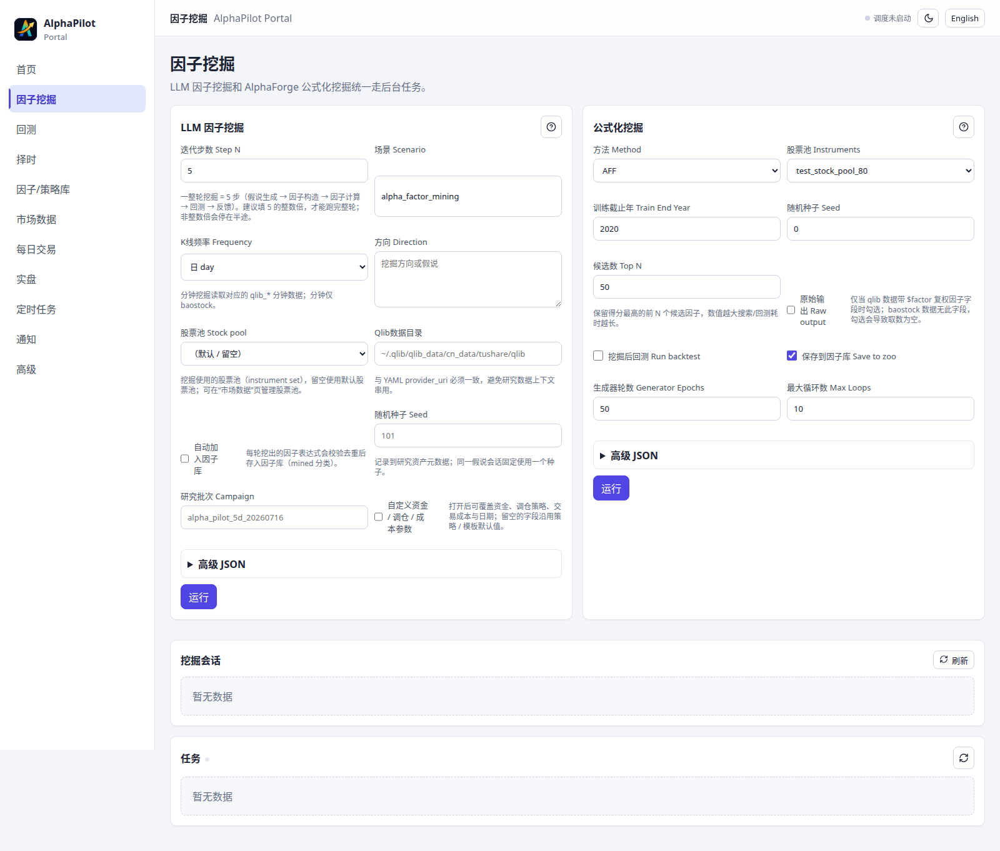
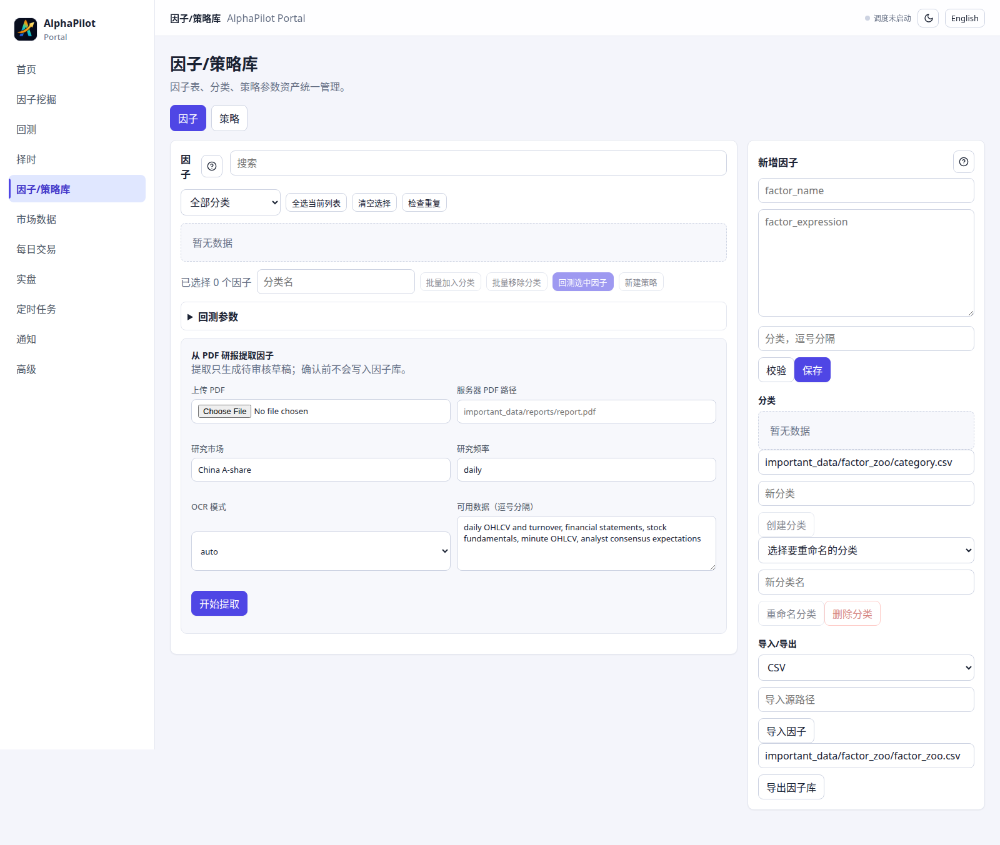
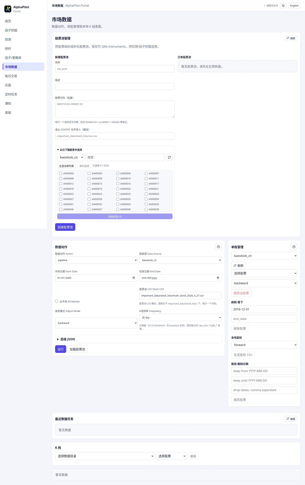
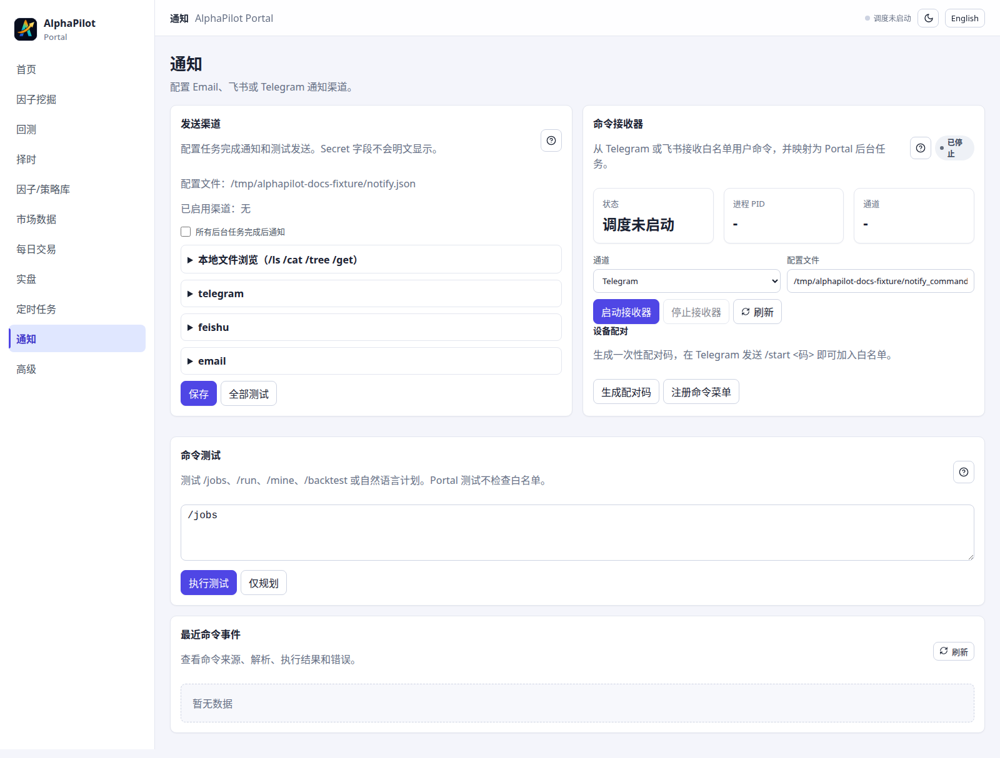

<div align="center">


### LLM 驱动的量化研究、模拟盘与实盘执行平台

[中文](README.md)&nbsp;|&nbsp;[English](README_en.md)

`多 Agent 因子挖掘`&nbsp;·&nbsp;`Qlib 回测`&nbsp;·&nbsp;`量化择时`&nbsp;·&nbsp;`模拟盘 / 实盘`&nbsp;·&nbsp;`Web 门户`&nbsp;·&nbsp;`Telegram / 飞书 通讯`

<p>
  
  
  
  
</p>

[快速开始](#-快速开始)&nbsp;·&nbsp;[核心功能](#核心功能)&nbsp;·&nbsp;[典型工作流](#-典型工作流)&nbsp;·&nbsp;[文档](#-更多文档)&nbsp;·&nbsp;[Docker 部署](docs/DOCKER.md)

</div>

---

## 项目简介

AlphaPilot 是一个面向股票的量化研究与交易平台，覆盖数据准备、因子生成、回测评估、策略沉淀、日频信号、模拟盘和实盘执行。项目使用 LLM 驱动多 Agent 因子研究流程，使用 Qlib 完成回测与信号验证，并通过统一的 Live Runtime 将研究信号接入风控、订单管理、券商网关和审计账本。Web 门户用于集中管理数据、任务、研究资产、通知和交易运行状态。

## 核心功能

| 能力 | 关键入口 | 说明 |
|------|----------|------|
| 因子挖掘 | `alphapilot mine` | LLM 多 Agent 流程 + AlphaForge / GP / RL / AFF 公式化方法 |
| 回测评估 | `alphapilot backtest` | 组合回测、逐因子 IC 快筛、排行榜与收益曲线 |
| 新建策略 | `alphapilot strategy_create` | 从因子库挑选因子沉淀为策略资产（因子 + 模型 + 调仓/成本/日期） |
| 策略复测 | `alphapilot strategy_backtest` | 复用已沉淀的策略资产与模型继续验证 |
| 日频信号 | `alphapilot daily_signals` | 按交易日推进持仓、生成单日调仓信号 |
| 交易会话 | `alphapilot trade_session_create` | 将策略快照为可恢复的独立日频交易账户 |
| 量化择时 | `alphapilot trading_instance_create` / `trading_backtest` | 通过正式策略实例完成技术指标信号预览、统一回放和受控部署；0.2.0 已移除旧 `timing_*` 入口 |
| 模拟盘 / 实盘 | `alphapilot live_*` | `dry_run` / `paper` / `simulation` / `live` 运行模式、统一风控与 OMS、守护进程、恢复对账和审计账本；XTP Pro / EMT 实盘与 OpenCTP TTS 柜台仿真通过可选插件接入 |
| 统一门户 | `alphapilot portal` | 数据、因子、回测、择时、任务、通知和实盘控制集中到同一界面 |
| 数据准备 | `alphapilot prepare_data` | baostock / tushare → Qlib 数据链路 |
| 通知与远程 | `alphapilot notify_commands` | 任务完成推送（Telegram / 飞书 / 邮件）+ 聊天命令远程发起与查询任务 |

### 因子挖掘

AlphaPilot 的主线能力是自动化因子研究。你可以用自然语言启动 LLM 驱动的多 Agent 挖掘流程，也可以在同一套项目里使用公式化方法生成候选因子，再统一进入校验、回测和资产沉淀。

- 统一管理 Idea Agent、Factor Agent、Eval Agent 三段研究流程
- 支持 `alphapilot mine` 启动 LLM 驱动的因子挖掘
- 支持 GP、RL、AFF 等公式化挖掘方法
- 因子可落入因子库，并继续进入回测或策略资产管理

关键入口：`alphapilot mine --direction "你的市场假说"`

<div align="center">
  
  <br><br>
  
</div>

### 回测与评估

项目内置多种回测与评估模式，既能做正式组合回测，也能快速筛选大量候选因子。首页只保留常用入口，更多回测命令与参数见 [CLI 命令参考](docs/alphapilot-cli.md)。

- `multi_combined`：多因子合并训练并完成组合回测
- `single_ic`：逐因子快速计算 IC、RankIC、ICIR
- `multi_sequential`：逐因子分别跑完整组合回测
- 门户「回测」页统一可视化：收益 / 超额 / 账户 / 换手率曲线、每日明细、因子排行榜与对比基准

关键入口：`alphapilot backtest --factor_path /path/to/factors.csv`

<div align="center">
  
</div>

### 策略复测与日频信号

当你已经沉淀了策略资产后，可以直接复用已有因子和模型继续验证，而不必重新跑完整挖掘流程。对于按日推进的研究或模拟交易场景，还可以基于已有策略生成单日调仓信号。

- `strategy_backtest` 支持对已保存策略资产重新回测
- `daily_signals` 支持按指定交易日推进持仓状态
- `trade_session_create` / `trade_session_show` / `trade_session_history` 可管理独立的日频交易会话，持有自己的策略快照、持仓状态和历史记录
- 适合做模型复用、策略复验和单日调仓演练
- 结果可回流到策略资产和门户页面中统一查看

关键入口：`alphapilot strategy_backtest --strategy_name "<策略名>" --mode=retrain`

### 模拟盘与实盘交易

实盘系统把研究侧生成的目标持仓或择时信号接入统一执行链路：`LiveRuntime → LiveEngine → RiskGate → BrokerGateway`。默认模式是不会路由订单的 `dry_run`，本地演练使用 `paper`，外部柜台仿真使用 `simulation`；只有显式选择 `live` 并再次确认后，命令才允许向真实券商路由。

- 支持 `dry_run`、`paper`、`simulation`、`shadow`、`live` 运行模式，以及前台运行和长驻 daemon
- 支持人工委托、撤单和目标组合提交；自动策略只能通过持久化实例与 `trading_*` 部署控制启动
- 所有订单统一经过交易时段、整手、价格、资金、持仓、集中度、单笔和日累计限额检查
- 维护 OMS 状态、追加式审计账本、运行时快照和恢复对账；交易通道断线会触发 halt，恢复后仍需人工检查再继续
- XTP Pro、EMT 和 OpenCTP TTS 接入已从核心解耦为可安装、可卸载的 pip 插件，交易通道和行情源可分别配置
- Portal「实盘交易」页面提供预检、连接、daemon 运维、正式策略部署、风控状态、委托与 ledger 查询

最安全的体验路径是先从 paper daemon 开始：

```bash
alphapilot live_daemon_start --mode paper --symbols 600000,000001 --cash 100000
alphapilot live_daemon_status --mode paper
alphapilot live_daemon_stop --mode paper
```

> **实盘风险提示：** 该功能仍在持续开发和券商环境验证中。接入真实账户前，请先完成 paper 演练、插件与网络预检、小额柜台测试，并逐项确认风控限额和恢复结果。不要在未理解 `--confirm_live`、daemon 状态和 ledger 的情况下启用真实路由。

详细安装、环境变量和验收流程见 [XTP Pro / EMT 实盘接入](docs/live-xtp.md)、[OpenCTP TTS 柜台仿真接入](docs/tts-simulation.md) 与 [实盘插件开发和安装](docs/live-plugins.md)。

### 统一 Web 门户

AlphaPilot 提供统一 Web 门户作为日常研究与运行入口，将数据、因子、回测、择时、任务、通知和实盘控制集中到同一个界面，避免在多个独立脚本和页面之间切换。

- 统一访问因子挖掘、回测、择时、策略库、市场数据、通知配置和实盘运行状态
- 支持后台任务、定时任务和结果查看
- 「回测」页内置完整可视化：累计收益 / 超额 / 账户 / 换手率图表、日期范围筛选、每日明细、因子排行榜与对比基准
- 「实盘交易」页区分实盘 / 柜台仿真 / 本地 Paper 工作区，并提供预检、daemon、策略、风险与审计控制面
- 适合本地研究环境和服务器部署场景

关键入口：`alphapilot portal`

<div align="center">
  
</div>

### 数据准备与管理

项目内置 A 股数据准备流程，可从原始行情准备到 Qlib 数据；因子 h5 cache 由研究和回测任务按需自动生成。首页只保留最短路径，下载源、复权方式和高级参数见详细文档。

- 支持 baostock 和 tushare 数据源
- 支持行情下载、复权处理和 Qlib 转换
- 支持股票池管理与单股数据维护
- 与因子挖掘、回测和日频信号直接衔接

关键入口：`alphapilot prepare_data download --stock_csv important_data/stock_lists/main_stock_2026_4_27.csv`

<div align="center">
  
  <br><br>
  
</div>

### 通知与远程控制

研究任务往往耗时较长，AlphaPilot 内置任务通知与双向聊天命令系统：后台任务结束会主动推送结果，你也可以直接通过聊天工具远程发起、查询和管理任务，无需一直守在终端前。

- 支持 **Telegram、飞书、邮件** 三种通知渠道
- 任务完成（或全部任务）自动推送结果与状态
- Telegram / 飞书 命令接收器，支持 `/mine`、`/backtest`、`/data`、`/status`、`/jobs`、`/cancel`、`/log`、`/result` 等命令
- 白名单用户鉴权，可远程发起任务并查看日志、产物与运行状态
- 凭证在门户「通知」页配置，或通过 `ALPHAPILOT_NOTIFY_*` 环境变量注入

关键入口：`alphapilot notify_commands --channel telegram`

<div align="center">
  
</div>

## 🚀 快速开始

以下流程以本地安装为主，目标是尽快跑通一条最短闭环。**Docker 一键部署**请直接看 [docs/DOCKER.md](docs/DOCKER.md)。

### 1. 创建环境

```bash
conda create -n alphapilot python=3.11
conda activate alphapilot
```

### 2. 安装项目

```bash
git clone https://github.com/ai-yang/AlphaPilot.git
cd AlphaPilot
pip install -e .
```

如需使用 Web 门户前端，请额外准备 Node.js，并在 `alphapilot/modules/portal/web` 下构建前端资源：

```bash
cd alphapilot/modules/portal/web
npm install
npm run build
cd ../../../../
```

### 3. 配置环境变量

```bash
cp .env.example .env
```

至少补齐以下配置：

```env
OPENAI_API_KEY=<your_api_key>
OPENAI_BASE_URL=<your_api_base_url>
CHAT_MODEL=<your_chat_model>
REASONING_MODEL=<your_reasoning_model>
```

API key 填写说明：

- `OPENAI_API_KEY` 要填写你实际使用的模型服务商签发的 key。
- 如果使用官方 OpenAI API，`OPENAI_BASE_URL` 一般填写 `https://api.openai.com/v1`。
- 如果使用 Azure OpenAI 或其他 OpenAI 兼容网关，需要同时把 `OPENAI_BASE_URL` 和 `OPENAI_API_KEY` 都替换成同一平台提供的值，不要把一个平台的 key 和另一个平台的 base URL 混用。
- `CHAT_MODEL` 和 `REASONING_MODEL` 也必须填写当前 `OPENAI_BASE_URL` 下真实可用的模型 ID。
- `.env` 中直接填写原始字符串即可，不要把真实 key 提交到仓库。

### 4. 准备数据

```bash
alphapilot prepare_data download \
  --stock_csv important_data/stock_lists/main_stock_2026_4_27.csv \
  --adjust_mode backward

alphapilot prepare_data convert \
  --stock_csv important_data/stock_lists/main_stock_2026_4_27.csv \
  --adjust_mode backward \
  --market main_stock_2026_4_27
```

### 5. 启动门户

```bash
alphapilot portal
```

默认访问地址：`http://127.0.0.1:19901`

> 时区默认 **Asia/Shanghai**（影响定时任务触发与时间戳显示）。可在门户「高级」页「门户设置」修改，或用 `alphapilot timezone Asia/Shanghai` 设置。

### 6. 运行一次任务

启动一次因子挖掘：

```bash
alphapilot mine --direction "行为金融学假说" --step_n 5
```

或对已有因子文件执行一次回测：

```bash
alphapilot backtest --factor_path /path/to/factors.csv
```

或者先把策略快照成一个可恢复的交易会话，再生成下一交易日的调仓计划：

```bash
alphapilot trade_session_create --strategy_name "<策略名>" --name demo_session --init_cash 500000
alphapilot daily_signals --session demo_session
```

或创建一个正式技术指标择时实例并运行统一回放：

```bash
alphapilot trading_instance_create \
  --instance_id=ma_5_20 --strategy_id=dual_ma --universe=sh.600000 \
  --params='{"short_window":5,"long_window":20}' --frequency=day \
  --data_policy='{"feature_adjustment":"none","history_window":21,"data_version":"local-v1"}' \
  --portfolio_policy='{"policy_id":"timing_fixed_exposure","params":{"target_percent":0.2}}'
alphapilot trading_instance_validate --instance_id=ma_5_20
alphapilot trading_backtest --instance_id=ma_5_20 \
  --options='{"data_dir":"./data","adjust_mode":"none"}' --wait=True \
  --output_dir=./results/ma_5_20
```

### 7. 体验模拟盘，再接入实盘（可选）

先查看当前运行模式和已安装的券商 / 行情插件：

```bash
alphapilot live_modes
alphapilot live_plugins
alphapilot live_brokers
alphapilot live_quote_providers
```

不安装任何真实券商插件也可以使用内置 paper broker。安装 XTP Pro / EMT 插件后，先做不登录、不下单的预检，再尝试连接：

```bash
alphapilot live_preflight --broker xtp --network=False
alphapilot live_connect --mode live --broker xtp --timeout 30
```

券商 SDK 和适配器不随核心仓库同步，请从授权的私有索引或本地 wheelhouse 安装。真实连接所需凭证只应放在本地 `.env` 或部署环境中；完整步骤见 [实盘接入文档](docs/live-xtp.md)。

## 🧭 典型工作流

1. 先用 `prepare_data` 准备行情和 Qlib 数据；因子 h5 cache 会由回测/挖掘任务按需自动生成。
2. 用 `mine` 或 AlphaForge 系列命令生成候选因子。
3. 用 `backtest` 做组合回测或 IC 快筛，并在门户中查看结果。
4. 将有效策略沉淀到策略资产，再用 `strategy_backtest`、`daily_signals` 或可恢复的 `trade_session` 持续验证。
5. 如需走向交易，按 `dry_run → paper → live` 顺序演练；通过预检、风控和恢复检查后，再把目标组合或择时策略接入 daemon。

## 📚 更多文档

- [中文文档中心：用户手册、开发文档与完整参考](docs/index.md)
- [完整 CLI 命令参考](docs/alphapilot-cli.md)
- [项目目录与架构说明](docs/alphapilot-structure.md)
- [Docker 部署与服务化运行](docs/DOCKER.md)
- [Docker 实际运行记录与排错](docs/DOCKER-RUN.md)
- [XTP Pro / EMT 实盘接入](docs/live-xtp.md)
- [OpenCTP TTS 柜台仿真接入](docs/tts-simulation.md)
- [实盘券商/行情 pip 插件开发与安装](docs/live-plugins.md)
- [important_data 目录、模板与资产说明](important_data/README.md)
- [AlphaForge 相关说明](alphapilot/modules/alphaforge/README.md)

## 📂 目录结构

```text
AlphaPilot/
├── alphapilot/          # 核心、研究系统、Live Runtime 与 Portal
├── important_data/      # 因子库、策略资产、模板、股票池
├── docs/                # CLI、Docker、架构与实盘接入文档
├── scripts/             # 数据维护及实盘预检 / smoke 工具
├── tests/               # 离线、集成与实盘契约测试
├── Dockerfile.live      # x86_64 券商 SDK 运行镜像
├── docker-compose.yml   # Docker 服务编排
└── README_en.md         # 英文项目首页
```

XTP Pro / EMT 的 SDK 绑定和 broker 插件属于可选、可能受许可约束的独立包，不是 AlphaPilot 核心源码的一部分；开发环境中出现的本地插件目录默认不参与 Git 同步。

## 🚧 开发状态与路线图

> AlphaPilot 仍在持续开发中：目前存在部分已知 bug 正在修复与优化，功能和接口可能调整，项目会保持更新。

计划中的方向：
- [ ] 加入美股的支持
- [ ] 继续扩展量化择时策略、分钟级研究能力和选股策略优化
- [ ] 优化交互界面，加入更多的可以调节的选项，包括调仓方法，LightGBM等模型参数设置
- [ ] 接入更多因子挖掘方法
- [ ] 持续修复已知问题、完善文档与稳定性
- [ ] 持续完善模拟盘/实盘交易系统、券商适配、恢复流程和安全控制

欢迎通过 Issue / PR 反馈问题与建议。

如果有疑问或者开发问题也可以发送邮件咨询：ruiwong@zju.edu.cn

## 开发日志

| 日期 | 类型 | 功能/模块 | 目标 | 关键改动 | 影响入口 | 验证 | 状态/后续 |
|------|------|-----------|------|----------|----------|------|-----------|
| 2026-07-15 | 实盘验收 | 全接口验收、Broker UAT v2 与旧入口删除门禁 | 以一次性完整等价验收和真实券商回报证明正式链路可替代旧入口，同时保持 LIVE 20/5 日门禁独立 | schema v8 保存 Git/核心代码/native SDK/插件哈希、两子订单累计金额和 callback 状态；增加只读预检、私有凭据包装器、泄漏扫描，并拆分 removal/live qualification | `/api/trading/{compatibility,removal-check,broker-uat-runs}`、`alphapilot trading_broker_uat_preflight`、`scripts/broker_uat_local.py` | 全量后端与 Portal、正式接口矩阵、OpenAPI/CLI、wheel、XTP/EMT 真实模拟 UAT | 只有 removal qualification 全绿才删除旧入口；自动 LIVE 仍需独立 20 PAPER 日、5 SHADOW 日、parity 与人工授权 |
| 2026-07-14 | 迁移与验收 | 新链路等价、Broker UAT 与旧入口删除门禁 | 在不提前删除兼容入口的前提下证明正式链路等价、确定且可恢复 | timing 兼容入口转接正式 REPLAY；增加精确历史窗口、决策 provenance、REPLAY/SHADOW parity、qualification、XTP/EMT 共用 UAT harness、多环境调用证据、schema v6/v7 和 commit 绑定的发布验证；固定 0.2.0 Sunset | `/api/trading/{compatibility,parity-runs,broker-uat-runs}`、`alphapilot trading_{compatibility,removal_check,parity_*,qualification,broker_uat_*}`、`docs/strategy-trading-migration-0.2.md` | 全量测试、Portal coverage/typecheck/build、OpenAPI/CLI、依赖边界、变更行覆盖率和 wheel smoke 必须由发布脚本在干净 commit 上生成报告 | 正式替代与兼容演练工具已落地；后续由 v8 验收门禁决定删除，20/5 日仅约束自动 LIVE |
| 2026-07-14 | 全链路重构 | 策略实例到交易执行 | 让规则择时和 Qlib 横截面选股分别共享可恢复的信号、组合、账户 sizing、回放和实盘执行链路 | 新增纯 trading contracts、v1/v2 provider 生命周期与隔离 worker、独立组合政策注册、不可变 Qlib 研究 artifact、D 日决策/D+1 sizing、统一 ReplayRuntime、卖出后买入执行状态机、账户边界、操作员 token/LIVE approval/审计、schema v5 起始迁移、正式 `/api/trading`/`trading_*` CLI 和 Portal 工作台；组合策略只预留接口 | `/api/trading/*`、`alphapilot trading_*`、Portal「择时/实盘」页、`docs/strategy-trading-full-chain.md` | 后端与 Portal 回归、typecheck 和生产构建 | 代码闭环完成；自动 LIVE 默认关闭，仍需 20 日 PAPER、5 日 SHADOW 和 XTP/EMT UAT 后才可受限试运行 |
| 2026-07-14 | 安全重构 | 策略运行安全闭环 | 让自动策略只有在部署状态、daemon 实况、账户绑定和恢复对账一致时才可路由 | 新增 `DeploymentCoordinator`、daemon control port、全绑定自动路由授权、实例/账户/全局 kill switch、真实数据但不可路由的 SHADOW、按配置哈希绑定的 PAPER/SHADOW stage evidence、SQLite v3 顺序迁移与备份；预留并行选股/个股择时/市场择时公共契约但不实现组合算法 | `/api/trading/deployments/*`、`/api/trading/stage-runs/*`、`/api/trading/kill-switches/*`、`alphapilot live_daemon_start --strategy-instance-id`、`docs/strategy-runtime.md` | 全量后端、Portal 前端和新增安全/迁移回归 | 完成首个安全闭环里程碑；仍需执行状态机、真实券商 UAT 和连续 PAPER/SHADOW 运行证据后才可小规模实盘 |
| 2026-07-10 | 重构 | 实盘券商/行情插件 | 将券商 SDK 与 AlphaPilot 核心解耦，支持可发现、可安装和可卸载的实盘接入 | 将 XTP Pro 和 EMT 重构为 `alphapilot.live.plugins` entry point 插件，交易/行情通道可分别配置；新增插件发现、可用性检查及 `live_plugins` 入口 | `alphapilot live_plugins` / `live_brokers` / `live_quote_providers`；Portal「实盘」页；`docs/live-xtp.md`；`docs/live-plugins.md` | 新增插件安装与注册表测试，并覆盖 CLI、Portal 和 gateway 回归 | 仍在开发；需在目标券商环境持续验证连接、恢复和实盘安全控制 |
| 2026-07-07 | 新增 | 模拟盘/实盘交易系统 | 打通从研究信号到模拟盘/实盘执行的统一交易层，并通过显式风控与确认流程约束真实资金操作 | 新增 `live` system/module，支持 paper、dry-run、live 模式；新增券商注册表与实盘适配；新增运行时预检查、连接、状态查询、手动下单、目标组合提交、守护进程生命周期控制、策略启动/暂停/恢复/停止、风控状态、追加式账本事件、恢复辅助能力，以及 Portal 实盘 API/UI 集成 | `alphapilot live_*` CLI；Portal「实盘」页；`/api/live/*`；`docs/live-xtp.md`；`Dockerfile.live` | 新增并扩展 live engine/runtime/risk/registry/strategy-runner/daemon/recovery/events 测试，以及 Portal live API/前端覆盖 | 仍在开发；后续继续验证券商侧行为、生产恢复、账户安全限制与实盘运行稳定性 |
| 2026-07-01 | 新增 | 量化择时系统 | 在现有选股/回测流程之外提供可复用的技术指标择时能力，并为后续模拟盘/实盘接入预留执行边界 | 新增 `timing` system/module 与 `alphapilot timing_strategies` / `timing_signal` / `timing_backtest` CLI；实现 BOLL、SMA、双均线、RSI、KDJ、Aroon、StochRSI、ARBR 等内置策略；新增 pandas 技术指标与信号工具、长仓/空仓回测引擎、下一根 bar 开盘成交、手续费/滑点/整手约束、signals/trades/equity_curve/positions/summary 产物；Portal 新增「择时」页、API、后台任务与结果预览；股票池创建/追加支持从已下载股票中勾选；修复前端 `ignoreDeprecations` 以恢复 TypeScript 5.x typecheck | `alphapilot timing_*` CLI；Portal「择时」页；`/api/timing/*`；后台 job `timing_backtest`；Portal「市场数据」股票池管理 | 新增 `tests/test_timing_indicators.py`、`tests/test_timing_engine.py`、`tests/test_timing_system.py`；扩展 CLI、Portal API/job、前端页面与参数规格测试 | 已完成基础版；后续继续扩展分钟级择时、组合级资金分配与实盘适配 |
| 2026-06-30 | 新增 | 分钟级数据工作流 | 将 AlphaPilot 从日频扩展到分钟级别，支持盘中研究流程 | 已支持分钟级别的数据下载、展示、因子挖掘和回测功能 | 市场数据下载；Portal 数据展示；因子挖掘；因子回测 | 待完整回归 | 已完成 |
| 2026-06-29 | 新增 | 股票池管理 | 让用户可批量将股票组织成命名股票池，并在回测与因子挖掘中复用 | 新增 `stock_pool` CLI 模块及完整增删改查（`pool_create` / `pool_list` / `pool_add` / `pool_remove` / `pool_rename` / `pool_delete` 等）；股票池以 JSON 为真实来源并同步到 Qlib instruments；Portal「市场数据」页新增股票池管理区块，挖掘 / 回测 / 库管理 / 调度器表单的「市场 / 股票池」字段改为股票池下拉选择 | `alphapilot pool_*` CLI；Portal「市场数据」页；挖掘 / 回测 / 库管理 / 调度器表单；`/api/data/instrument-sets`；`/api/modules/run` | `pytest tests/test_stock_pool.py tests/test_kernel_registry.py`；`npm run build`；`npm run test` | 已完成 |
| 2026-06-26 | 新增 | Portal 参数帮助 | 让复杂任务/配置面板更易理解、更一致 | 新增可复用问号帮助面板，扩展挖掘、回测、库管理、市场数据、日频交易、调度器、通知与高级设置说明；补充 Daily Trade 左侧标题 | Portal 各任务/配置面板 | `npm run build`；`npm run typecheck` 因现有 `tsconfig.json` 中 `ignoreDeprecations: "6.0"` 与 TypeScript 5.9 不兼容而阻塞 | 已完成；修复 tsconfig 后再依赖 typecheck |
| 2026-06-24 | 优化 | Portal 市场数据 / K 线图 | 提升本地 K 线查看体验 | 主图 + 副图布局；副图支持成交额、成交量、换手率、涨跌幅切换；新增范围按钮、统一 hover、深浅主题适配 | Portal「市场数据」页 | `npm run typecheck`；`npm run build` | 已完成 |
| 2026-06-24 | 新增 | 因子库 / 重复检查 | 帮助清理重复或近似重复因子，降低因子库维护成本 | 新增重复因子检测、建议保留/删除、批量删除相关 API 与 Portal 入口 | Portal「因子/策略库」页；`/api/factors/duplicates`；`/api/factors/bulk-delete` | 前端 `npm run typecheck`；`npm run build` 覆盖 UI 编译 | 已完成 |

> [!WARNING]
> 实盘方案仍在验证中，请勿随意登录自己的实盘账号。

## 🙏 致谢

本项目受到 [RndmVariableQ/AlphaAgent](https://github.com/RndmVariableQ/AlphaAgent) 以及[DulyHao/AlphaForge](https://github.com/DulyHao/AlphaForge)启发，进行开发与优化。感谢原作者与社区的工作。

<div align="center">
<br>

&nbsp;&nbsp;&nbsp;&nbsp;&nbsp;&nbsp;&nbsp;&nbsp;<b>×</b>&nbsp;&nbsp;&nbsp;&nbsp;&nbsp;&nbsp;&nbsp;&nbsp;

<br><br>
<sub><b>AlphaPilot · 股票量化研究平台</b>&nbsp;&nbsp;×&nbsp;&nbsp;<b>ZJU Eagle Lab</b></sub>
</div>
