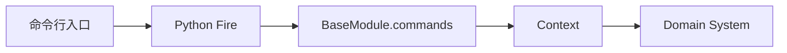

# AlphaPilot CLI 使用与参考

AlphaPilot 当前有 117 个第一方公共 CLI 命令。完整参数表由运行时代码生成，请查看 [CLI 完整参考](reference/cli.md)；本页保留原公开链接，并说明最常用的使用方式。



## 帮助和参数

```bash
alphapilot modules
alphapilot <command> -- --help
```

- 推荐使用 `--name=value`，避免 shell 对空格和负数产生歧义。
- list 通常使用逗号分隔，例如 `--universe=600000.SSE,510300.SSE`。
- dict 使用 JSON 字符串，例如 `--params='{"window":20}'`。
- 布尔值显式写成 `True` 或 `False`。

## 常见工作流

```bash
# 数据
alphapilot prepare_data pipeline --adjust_mode=backward
alphapilot pool_list

# 因子和研究回测
alphapilot mine --direction="量价反转" --step_n=3
alphapilot factor_list
alphapilot strategy_backtest_list

# 策略实例与统一回放
alphapilot trading_definitions
alphapilot trading_instances
alphapilot trading_preview --instance_id=ma_5_20
alphapilot trading_backtest --instance_id=ma_5_20 --wait=True

# PAPER 运行时
alphapilot live_daemon_start --mode=paper --symbols=600000.SSE --cash=100000
alphapilot live_daemon_status --mode=paper
alphapilot live_daemon_stop --mode=paper
```

对应说明：

- [数据与股票池](user/data-and-pools.md)
- [因子挖掘与因子库](user/factor-mining-and-library.md)
- [策略资产与研究回测](user/strategy-assets-and-backtests.md)
- [策略实例](user/strategy-instances.md)
- [模拟与实盘](user/live-trading.md)

## 支持状态

- `ui`、`backtest_ui`：已弃用，只输出 Portal 迁移提示。
- `data_viz`、`backtest_viz`：Portal 的独立 Streamlit 回退工具。
- `trading_broker_uat_*`：仅本地受控测试，不是普通交易接口。
- 旧 `timing_*`、daemon strategy 和手工 stage evidence 命令已删除。

自动化调用前，应同时检查[完整参考](reference/cli.md)中的“影响”和“状态”列。长运行命令、人工交易、部署写操作和 UAT 不应被大模型在没有人工确认的情况下自动执行。
