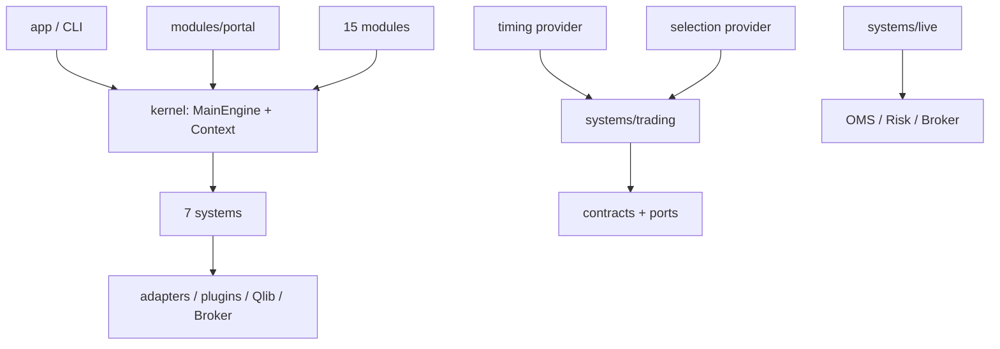
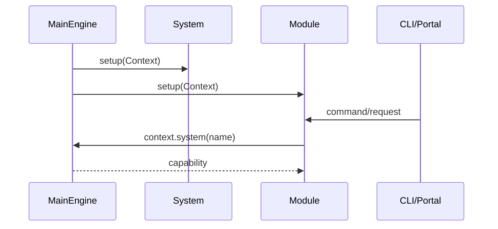

# AlphaPilot 架构与目录说明

当前项目由内核、7 个正式系统、15 个业务模块、策略子系统和外部适配器组成。旧“四大系统”描述已经不再适用。

## 顶层目录

| 目录 | 职责 |
|---|---|
| `alphapilot/kernel` | 配置、Context、系统/模块注册和插件发现 |
| `alphapilot/systems` | 稳定领域能力和公共契约 |
| `alphapilot/modules` | CLI、Portal workflow 和跨系统编排 |
| `alphapilot/adapters` | LLM 等外部边界实现 |
| `alphapilot/components` | 挖掘流程可复用组件 |
| `alphapilot/core` | 研究 loop、知识、演化和通用基础设施 |
| `alphapilot/oai` | 大模型配置和调用 |
| `plugins` | XTP/EMT 等可选独立包 |
| `strategies` | 本地显式 manifest 自定义策略 |
| `important_data` | 用户维护的股票池、因子和策略资产 |
| `git_ignore_folder` | 运行状态、缓存、回测和审计产物 |

## 系统

- `data`：下载、复权、Qlib 转换和标的维护。
- `factor`：表达式校验、因子库和分类。
- `strategy`：研究策略资产、模型和复测。
- `backtest`：Qlib 研究回测和产物。
- `notify`：通知渠道 facade。
- `live`：runtime、OMS、Risk、Broker、恢复和 ledger。
- `trading`：策略定义/实例、统一回放、部署、授权和证据。

逐系统说明见[开发文档](developer/index.md)。

## 模块与依赖

模块继承 `BaseModule`，在 `setup(Context)` 后通过 `commands()` 贡献 CLI。模块不应直接构造系统；系统也不应反向导入模块或 Portal。

## 策略到交易依赖方向

`trading.contracts` 是纯类型层；timing/selection/data/live 通过 Protocol 接入 application。策略不访问 Broker，Live 不解释策略名称。完整设计见[策略到交易全链路](strategy-trading-full-chain.md)。

## 扩展

第一方组件由 composition root 注册，并在项目 entry points 镜像。第三方可使用：

- `alphapilot.systems`
- `alphapilot.modules`
- `alphapilot.strategies`
- `alphapilot.portfolio_policies`
- `alphapilot.live.plugins`
- `alphapilot.report_factor.ocr_providers`

详细约束见[内核与插件](developer/kernel-and-plugins.md)和[自定义策略](developer/strategy-extension.md)。
