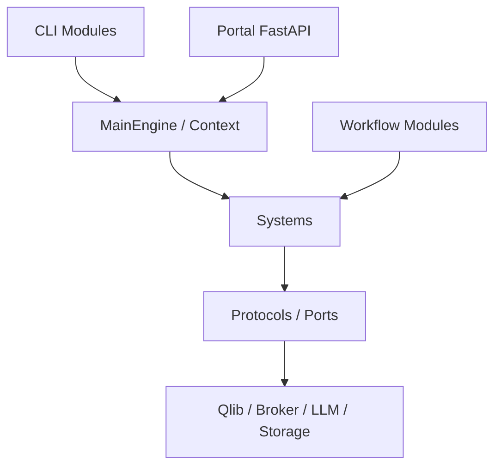

# AlphaPilot 开发文档

AlphaPilot 使用“系统提供能力、模块编排能力、Portal/CLI 作为适配层”的结构。开发前先确认修改属于领域系统、业务模块还是外部适配器，避免把 Broker、Qlib 或 Portal 依赖带入公共契约。

## 核心指南

- [内核、注册与插件](kernel-and-plugins.md)
- [Portal 与 HTTP API](portal-and-api.md)
- [自定义策略、PortfolioPolicy 与 artifact](strategy-extension.md)
- [测试与贡献](testing.md)
- [组件覆盖矩阵](../reference/components.md)

## 正式系统

- [data](systems/data.md)
- [factor](systems/factor.md)
- [strategy](systems/strategy.md)
- [backtest](systems/backtest.md)
- [notify](systems/notify.md)
- [live](systems/live.md)
- [trading](systems/trading.md)

## 策略子系统

- [timing](subsystems/timing.md)
- [selection](subsystems/selection.md)
- [research](subsystems/research.md)

## 模块

15 个内置模块的职责、CLI、系统依赖和测试入口见 [模块开发文档目录](modules/README.md)。

## 依赖原则

- `trading.contracts` 不导入 `live`、`timing`、`selection`、`backtest` 或 Portal。
- 模块通过 `Context` 获取系统，不直接构造系统实现。
- 策略和 PortfolioPolicy 不接触 Broker；执行必须经过目标、planner、OMS 和 Risk。
- Portal handler 只做解析、认证、审计和调度，不承载领域算法。
- 第三方插件是可信代码和故障隔离边界，不是安全沙箱。
