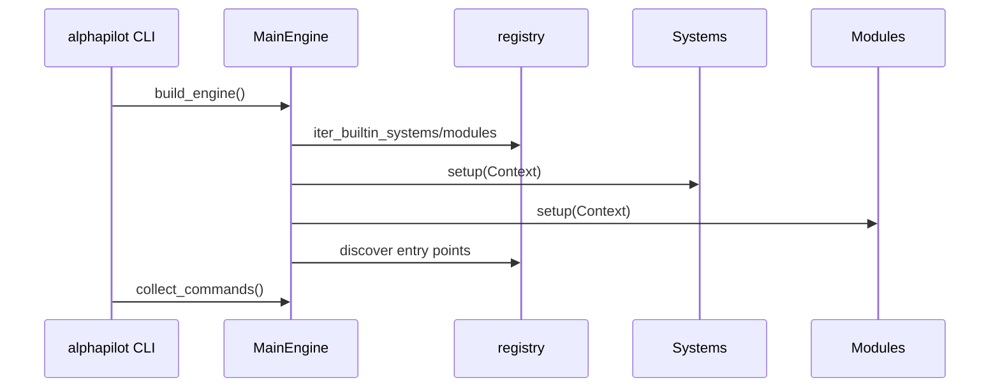

# 内核、注册与插件

## 启动模型



`MainEngine` 持有唯一 `AppConfig` 和 `Context`。系统先加载，模块后加载；模块只能通过 `context.data()`、`context.factor()` 或 `context.system(name)` 访问系统。`shutdown()` 负责释放线程池等资源。

## 注册来源

- composition root：`alphapilot.kernel.registry` 是源码运行时的内置来源。
- Python entry point：`alphapilot.systems` 和 `alphapilot.modules` 支持已安装扩展。
- 当前 15 个第一方模块同时在 composition root 和项目 entry points 中声明，测试保证集合一致。
- 相同名称已由内置组件占用时，外部 entry point 不覆盖它。

最小模块：

```python
from alphapilot.kernel.base import BaseModule

class ExampleModule(BaseModule):
    name = "example"

    def setup(self, context):
        self.context = context

    def hello(self, value: str = "world") -> dict:
        return {"hello": value}

    def commands(self):
        return {"example_hello": self.hello}
```

```toml
[project.entry-points."alphapilot.modules"]
example = "example_package.module:ExampleModule"
```

## 错误边界

单个第三方 entry point 导入失败会被跳过，不能阻止主进程启动。需要向用户暴露失败细节的插件类型（如 live broker）有自己的诊断注册表。模块命令重名时后加载者会覆盖命令映射，因此插件必须使用稳定前缀并在测试中检查冲突。

## 其他扩展组

- `alphapilot.strategies`：策略定义/provider。
- `alphapilot.portfolio_policies`：信号到目标权重政策。
- `alphapilot.live.plugins`：Broker 和行情插件。
- `alphapilot.report_factor.ocr_providers`：OCR provider。

相关测试：内核注册、CLI contract、wheel 隔离安装和插件失败隔离。新增系统或模块时还要更新 `docs/catalog.json`，否则文档生成检查失败。
