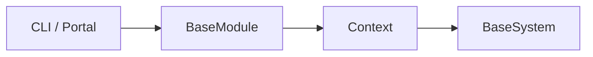

# 内置模块开发文档

模块通过 `Context` 编排系统并向 CLI 或 Portal 提供业务入口。当前 15 个模块：

- [alpha_mining](alpha-mining.md)、[alphaforge_aff](alphaforge-aff.md)、[alphaforge_search](alphaforge-search.md)
- [factor](factor.md)、[report_factor](report-factor.md)
- [platform](platform.md)、[data_viz](data-viz.md)、[stock_pool](stock-pool.md)
- [strategy_backtest](strategy-backtest.md)、[qlib_yaml](qlib-yaml.md)、[backtest_viz](backtest-viz.md)
- [daily_trade](daily-trade.md)
- [portal](portal.md)
- [live](live.md)、[trading_cli](trading-cli.md)

新增模块必须使用独立命令前缀、避免在 import 阶段加载重依赖，并更新模块注册、CLI snapshot 和文档 catalog。
