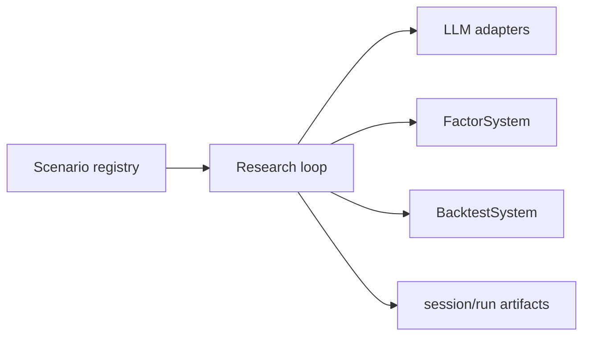

# AlphaMiningModule

## 用户能力与 CLI

LLM 驱动的因子挖掘和单次因子回测编排器，提供 `mine`、`backtest`、会话/运行列表与删除共 6 个 CLI。

## 调用流程与产物

`run_mining` 根据 scenario 解析 loop、prop settings 和 Qlib 配置；重型组件延迟导入。每轮输出可选择写入因子库。删除会话和 run 必须经过 child-path 校验，不能删除共享 cache 目标。

## 参数、失败与扩展测试

扩展新场景时在 scenario registry 注册配置类，不在 module 内增加条件分支。测试入口覆盖参数解析、断点恢复、产物、路径安全和 mocked LLM；真实 LLM 使用专用 marker。
