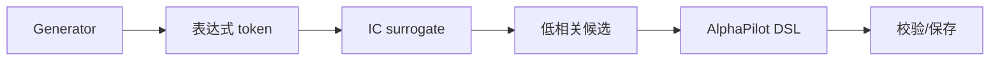

# AlphaForgeAFFModule

## 用户能力与 CLI

提供 `mine_aff`，使用 generator/predictor 的公式化因子搜索。torch 和 vendored engine 延迟导入，保证普通 CLI discovery 不要求安装重依赖。

## 调用流程与产物

模块把 survivor 交给共享 `alphaforge.pipeline.emit_factors`，再调用 FactorSystem 和可选 BacktestSystem。新增训练参数通过 `**kwargs` 传给 miner，但稳定的一阶参数应显式出现在签名中。

## 参数、失败与扩展测试

测试使用小规模 seed 固定任务，验证翻译、阈值、保存和可选回测；GPU/长训练归入 slow tier。
