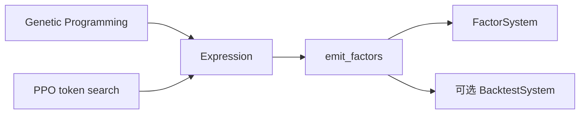

# AlphaForgeSearchModule

## 用户能力与 CLI

提供 `mine_gp` 和 `mine_rl` 两种非 LLM 公式搜索，共用表达式翻译、校验、研究 metadata 和输出 pipeline。

## 调用流程与产物

GP 依赖 vendored gplearn；RL 依赖 stable-baselines3/sb3-contrib。模块不应在 setup/import 阶段导入这些包。`campaign_id` 和 research hypothesis 用于研究证据关联。

## 参数、失败与扩展测试

测试区分轻量翻译/管线和 slow 搜索；所有随机路径必须接受 seed。
