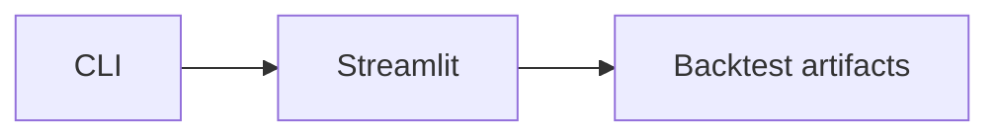

# BacktestVizModule

## 用户能力与 CLI

提供 `backtest_viz`，启动独立 Streamlit 回测 artifact 查看器，是 Portal “回测”页的回退能力。

## 调用流程与产物

## 参数、失败与扩展测试

启动时打印 Portal 优先提示。模块只读工作区，不实现指标计算；产物解析应复用 BacktestSystem results/artifacts。测试验证 subprocess 参数和资源定位。
