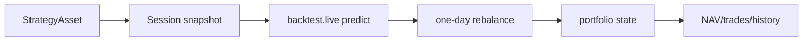

# DailyTradeModule

## 用户能力与 CLI

研究侧滚动交易会话模块，提供 daily signal/state 和 trade-session CRUD、资金、历史共 8 个 CLI。

## 调用流程与产物

模块复用 `systems/backtest/live` 的推理和单日 rebalance。会话保存不可变策略快照、账户状态和历史；cash 操作只改变模拟余额。YAML 参数可以来自 mapping、JSON 或文件。

## 参数、失败与扩展测试

该路径保留研究兼容能力，不形成正式 deployment evidence，也不能取得自动路由授权。测试覆盖日期推进、重复日期、state 恢复、现金、NAV/费用和会话删除。
