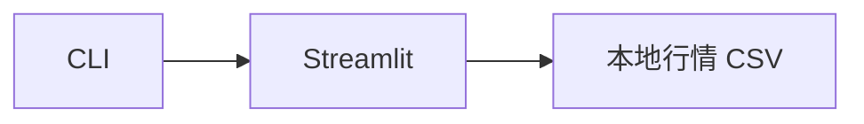

# DataVizModule

## 用户能力与 CLI

提供 `data_viz`，启动独立 Streamlit 本地 K 线查看器。它是 Portal “行情数据”页的回退工具，不参与 DataSystem 数据生产。

## 调用流程与产物

## 参数、失败与扩展测试

模块通过 `importlib.resources` 定位 app，并用 subprocess 启动。不得从 UI 写入交易状态或绕过 DataSystem 修改数据。测试只验证命令构造和资源存在，不在普通 CI 启动长期服务。
