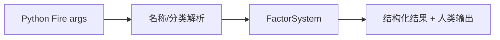

# FactorModule

## 用户能力与 CLI

FactorSystem 的 CLI 适配层，提供校验、添加、列表、重命名、分类和重复检测 12 个命令。

## 调用流程与产物

模块只解析逗号列表和打印 `FactorValidationResult`；不复制表达式规则。校验失败以非零退出码结束，便于自动化判断。Portal 的导入、导出、删除和批量回测能力直接调用 system/API，不要求 CLI 模块承担全部 HTTP 功能。

## 参数、失败与扩展测试

测试覆盖 Fire 参数、退出码、分类保留和系统调用；新增命令时更新完整 CLI 参考。
