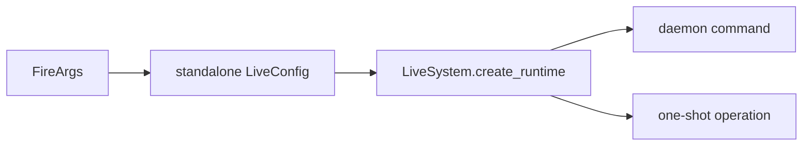

# LiveModule

## 用户能力与 CLI

LiveSystem 的人工运维和诊断 CLI，共 26 个命令：配置/插件/预检、一次性 connect/run/order/target、daemon 控制、行情、风险和 ledger。

## 调用流程与产物

命令必须区分 trade broker 与 quote provider，并对状态/账本目录使用同一 resolved config。人工订单标记 `origin=manual`；调用方不能传入 `automated` 授权。真实路由要求显式 `confirm_live`。

## 参数、失败与扩展测试

daemon start 只启动无匿名策略的 runtime；自动策略由 `strategy_instance_id` 和 DeploymentCoordinator 管理。测试覆盖参数解析、paper、IPC、确认、脱敏、目标计划和取消始终允许。
