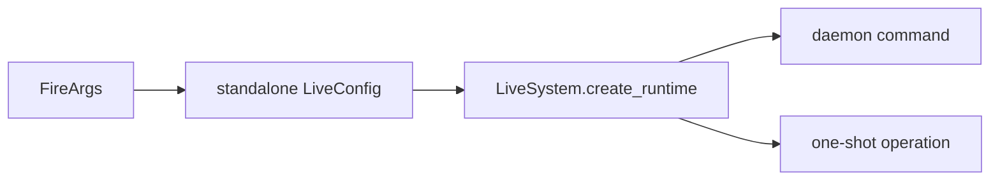

# LiveModule

## 用户能力与 CLI

LiveSystem 的人工运维和诊断 CLI，共 27 个命令：配置/插件/预检、一次性 connect/run/order/target、daemon 控制、动态 observer 行情订阅、行情查询、风险和 ledger。

## 调用流程与产物

命令必须区分 trade broker 与 quote provider，并对状态/账本/行情目录使用同一 resolved config。人工订单标记 `origin=manual`；调用方不能传入 `automated` 授权。真实路由要求显式 `confirm_live`；`live_daemon_subscribe` 只添加展示/录制用 observer，不请求路由确认。

## 参数、失败与扩展测试

`live_daemon_start` 只启动不绑定策略实例的 standalone runtime；自动策略由 `strategy_instance_id` 和 DeploymentCoordinator 管理。测试覆盖参数解析、paper、IPC、确认、脱敏、目标计划、取消始终允许，以及 observer 规范化、上限、部分成功和首 Tick 等待语义。
