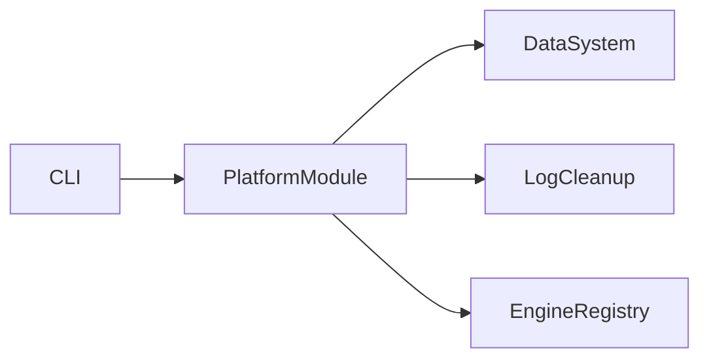

# PlatformModule

## 用户能力与 CLI

平台级 CLI 编排器，负责 DataSystem 入口、单股维护、日志清理、模块发现和两个历史 UI 迁移提示。

## 调用流程与产物

`prepare_data` 构造 `DataActionCommand` 再 dispatch；单股命令不直接访问目录。`clean_logs` 默认 preview。`modules` 返回当前 engine 的模块/命令。

## 参数、失败与扩展测试

`ui` 和 `backtest_ui` 只打印 Portal successor，标记为已弃用；不得恢复旧服务。测试覆盖 action 构造、dry-run、清理边界和弃用输出。
