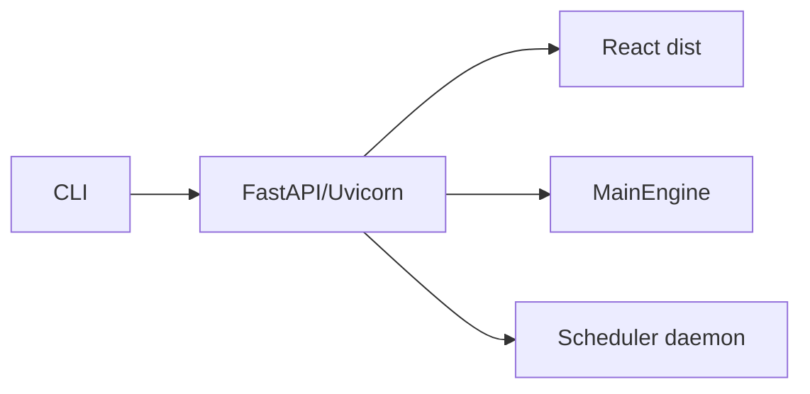

# PortalModule

## 用户能力与 CLI

提供 Portal server、重启、操作员鉴权设置、scheduler、timezone 和通知命令接收器共 6 个 CLI，是 React/FastAPI 的进程入口。

## 调用流程与产物

`portal` 应先应用非敏感配置、安装重启信号处理、写 runtime projection，再启动 Uvicorn；退出时清理 runtime。存在启用计划时自动启动 scheduler，但失败不能阻止 Portal 启动。

## 参数、失败与扩展测试

`portal_restart` 只作用于已记录的本机进程。`portal_operator_auth` 是安全模式的唯一写入口，保存到 Portal settings，校验环境覆盖冲突并记录 `local-cli` 审计；Portal runtime projection 用于判断是否需要重启。reload 模式面向开发。API 和前端开发约束见 [Portal 与 API](../portal-and-api.md)。
