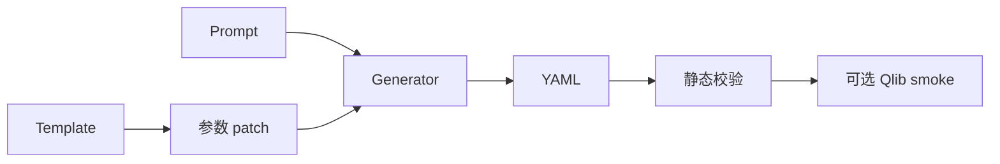

# QlibYamlModule

## 用户能力与 CLI

提供 `qlib_yaml_generate` 和 `qlib_yaml_validate`，把结构化参数和可选 LLM 提示转换为 Qlib qrun YAML。

## 调用流程与产物

参数文件必须是 JSON object；显式 CLI 参数覆盖文件 patch。生成器和 validator 位于 BacktestSystem 子包，module 只做输入加载、输出打印和失败退出码。

## 参数、失败与扩展测试

测试覆盖模板、优先级、非法 Schema、smoke timeout 和 helper copy；LLM prompt 路径使用 mock 或 real_llm marker。
