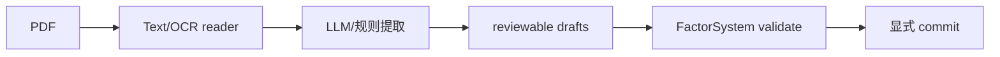

# ReportFactorModule

## 用户能力与入口

从 PDF 文本或 OCR 中提取可复核因子草稿，并在用户显式选择后提交到 FactorSystem。该模块没有公共 CLI，主要由 Portal API 和后台 worker 使用。

## 调用流程与产物

OCR registry 延迟构建并受锁保护。进程内可以调用 `register_ocr_provider`；Portal worker 的 provider 必须发布 `alphapilot.report_factor.ocr_providers` entry point，因为 worker 是新进程。

## 参数、失败与扩展测试

上传路径、页码、OCR 来源和草稿需要保留审计。任何草稿不得自动写入因子库。测试覆盖文本 PDF、OCR fallback、provider 失败、草稿校验、选择性提交、上传删除和路径安全。
