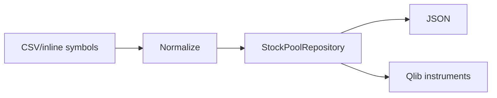

# StockPoolModule

## 用户能力与 CLI

提供股票池 CRUD、成员维护、描述和 CSV 导出共 10 个 CLI。Portal 通过 `/api/modules/run` 复用相同方法。

## 调用流程与产物

`StockPoolRepository` 统一规范代码、去重并原子更新 JSON 与 instruments。`pool_create` 拒绝覆盖；`pool_save` 显式覆盖；删除支持 dry-run。

## 参数、失败与扩展测试

运行中的策略实例绑定的是配置哈希和 universe，不应因为池文件变化静默换池。测试覆盖规范化、幂等、重命名、双文件一致性、导出和路径安全。
