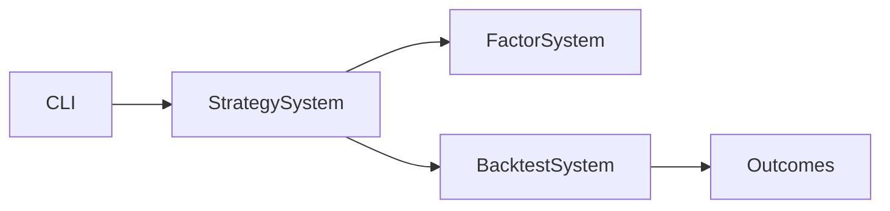

# StrategyBacktestModule

## 用户能力与 CLI

研究策略资产的 CLI 入口，提供 `strategy_create`、`strategy_backtest` 和 `strategy_backtest_list`。

## 调用流程与产物

模块规范化因子名和 JSON YAML patch，随后构造 `StrategyBacktestRequest`。`mode=retrain` 重新训练；其他模式必须由 StrategySystem 明确定义，不在 module 内猜测。

## 参数、失败与扩展测试

它属于研究资产链路，不等同于 TradingSystem 的策略实例 replay。测试覆盖资产创建、列表摘要、参数解析、模型 artifact 和 backtest delegation。
