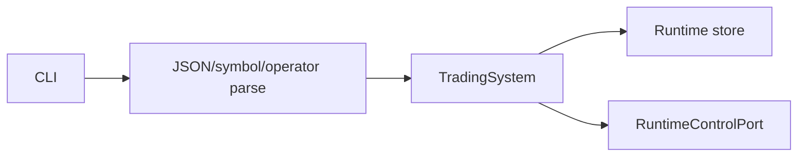

# TradingModule（trading CLI）

## 用户能力与 CLI

TradingStrategySystem 的正式 CLI 适配层，当前提供 31 个命令，覆盖定义、实例、preview、回放、部署、授权、parity、qualification、kill switch、审计和本地 Broker UAT。

## 调用流程与产物

所有输出使用可序列化结构；preview 支持 JSON/CSV，backtest 支持等待和输出目录。敏感操作构造 `OperatorContext` 并写审计。UAT start/resume/abort 只能在本地 CLI 提供。

## 参数、失败与扩展测试

手工 stage start/finish/evaluate 已从公共 CLI 和 service facade 删除，证据只能由 runtime 自动产生。新增命令不得重新暴露 Store 写接口。

测试覆盖全部命令 help、JSON 解析、文件输出、操作员审计、生命周期和 UAT 金额/确认；CLI 数量由 contract test 固定为 117 个全局命令。
