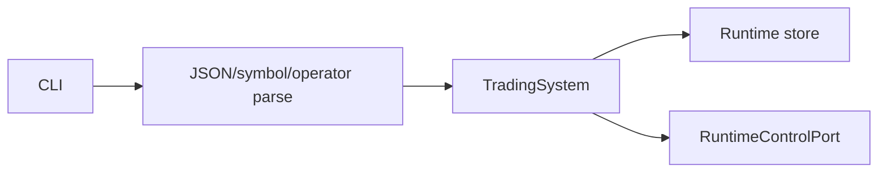

# TradingModule（trading CLI）

## 用户能力与 CLI

TradingStrategySystem 的正式 CLI 适配层，覆盖定义、实例、preview、回放、独立部署、运行诊断、通用决策比较、kill switch、审计和本地 Broker UAT。

## 调用流程与产物

所有输出使用可序列化结构；preview 支持 JSON/CSV，backtest 支持等待和输出目录。敏感操作构造 `OperatorContext` 并写审计。UAT start/resume/abort 只能在本地 CLI 提供。

## 参数、失败与扩展测试

旧 promote/authorize-live/qualification/parity/execution-binding 命令和手工 stage 写入均已删除。新增命令不得重新暴露这些门禁或 Store 写接口。

测试覆盖全部命令 help、JSON 解析、文件输出、操作员审计、生命周期和 UAT 金额/确认；CLI 数量由 contract test 固定为 118 个全局命令。
