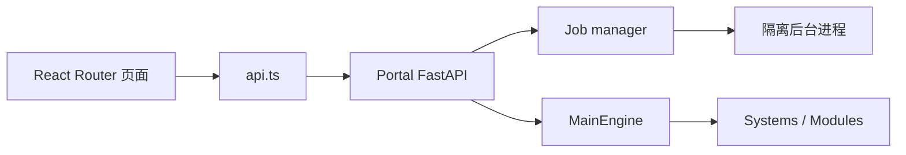

# Portal 与 HTTP API

## 结构

前端有 11 个正式路由。`pages.tsx` 承担研究与管理页面，复杂 live 页面拆为独立组件。FastAPI 提供 136 条路径、152 个操作，完整索引见 [HTTP API](../reference/http-api.md)。

## Handler 约束

- 请求模型负责输入验证；领域错误转换为 4xx，不应返回未处理 500。
- `/api/trading` 写操作调用操作员 token 校验并写审计事件。
- `/api/live` 人工运维入口默认依赖本机边界；若对外暴露，必须在外层添加认证、TLS 和访问控制。
- Broker UAT HTTP 端点只读，真实 UAT 只能由本地 CLI 发起。
- 后台任务的 Portal job manager 只负责进程和状态；trading backtest 的领域状态源是 runtime SQLite。

## 前端状态

普通资源通过 `useAsync` 加载；交易 token 只存在模块内存，不写浏览器持久化存储。页面切换不能隐式触发路由订单。确认弹窗、错误 toast 和运行状态刷新属于 UI 层，安全授权仍由服务端判断。

## 增加接口或页面

1. 在领域 system/module 实现并测试能力。
2. 添加类型化 FastAPI route，提供明确 summary 和错误响应。
3. 更新前端类型、调用和交互测试。
4. 如果新增页面，更新 router、导航、i18n、截图清单和 `docs/catalog.json`。
5. 重新生成 OpenAPI、Portal 和组件参考。

测试包括 OpenAPI 精确快照、Portal Vitest、交互 contract、Playwright 多路由、网络失败和真实写操作隔离。
