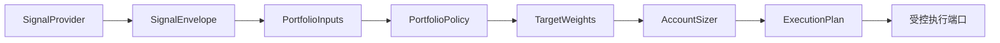

# 自定义策略、PortfolioPolicy 与 artifact

## 扩展边界



策略只负责信号，PortfolioPolicy 只负责目标权重。二者都不允许访问 Broker、提交订单或修改账户状态。

## Provider v1

v1 适配已有 DataFrame 策略：

```python
class MyTimingStrategy:
    required_history = 21

    def generate_signals(self, frame):
        result = frame.copy()
        result["signal"] = (result["close"] > result["close"].rolling(20).mean()).astype(int)
        return result
```

系统把它包装为 `INSTRUMENT_TIMING` provider。v1 用于低成本兼容，不支持精细生命周期状态；它不会被 v2 自动删除。

## Provider v2

v2 实现 `initialize`、`warmup`、`evaluate`、`snapshot`、`restore` 和 `stop`，并返回 `SignalEnvelope`。`evaluate` 必须是确定性的：相同 `as_of`、历史哈希和前置状态只能产生同一输出；历史修订应 fail closed。

定义需要声明：策略 ID、版本、API 版本、`signal_kind`、参数 JSON Schema、资产/频率、`required_history`、`supported_run_modes` 和状态版本；注册器会计算代码哈希。

## 本地 manifest

```toml
[strategy]
id = "my_timing"
version = "1.0.0"
kind = "model"
factory = "strategy:MyProvider"
api_version = 2
provider_api_version = 2
signal_kind = "instrument_timing"
supported_assets = ["equity", "fund"]
supported_frequencies = ["day"]
supported_run_modes = ["paper", "simulation", "shadow", "live"]
required_history = 61
state_schema_version = 2
parameter_schema_json = '''
{"type":"object","properties":{"model_name":{"type":"string"},"factor_set":{"type":"string"}},"required":["model_name","factor_set"],"additionalProperties":false}
'''
```

放置在 `strategies/<strategy_id>/strategy.toml`。注册器在进程启动时发现定义；修改代码或清单后应重启长驻进程。冲突或导入失败进入隔离，不应覆盖内置定义。

pip 包使用 `alphapilot.strategies`；政策包使用 `alphapilot.portfolio_policies`。第三方 worker 有超时和资源限制，但仍按可信代码处理。

## PortfolioPolicy

政策实现 `build(inputs, context) -> TargetWeights`，必须声明支持的 `SignalKind`、版本和参数 Schema。不得在 policy 内做股数取整、费用或 Broker 状态处理；这些属于 AccountSizer 和 planner。

## Artifact 与变更

模型选股实例只使用研究资产快照。manifest 绑定模型 SHA-256、因子版本、股票池、数据和政策版本。任何绑定变化都重算 `config_hash`：实例回到待验证状态，已有部署保留但标记 `stale`，直到重新验证并重新 PUT 部署。运行诊断和决策比较继续保留，但不会授予或撤销 LIVE 权限。

复杂策略建议把实现拆成 `factors.py`、`model.py`、`provider.py` 和可选 `state.py`。Provider 只编排特征与推理并输出信号；不要从 Provider 读取账户、连接 Broker 或执行仓位取整。多个模型、因子集合或超参数组合应分别形成不可变实例/config hash，公共仓位逻辑则复用独立 PortfolioPolicy。

测试至少覆盖 v1/v2、manifest、entry point、状态恢复、历史确定性、worker 超时、非法参数、重复 ID，以及任意两次 replay/deployment run 的可选决策比较。比较失败只能形成诊断，不能改变部署权限。
