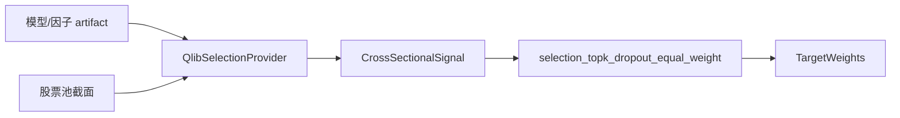

# Selection 子系统

`systems/selection` 把 Qlib 研究模型包装成横截面选股 provider。选股在同一时间截面比较股票池，不与单标的择时预设串行关系。

`qlib_selection` definition 只接受已快照研究资产。provider 读取模型和特征，输出分数/排名，不访问模拟账户文件。D 日 policy 解释信号形成权重，D+1 只使用最新账户、报价和合约重新 sizing。

模型、因子、股票池或数据版本必须进入 artifact/config hash。测试需要验证研究目录不被修改、分数确定性、Top-K/dropout、缺失标的、模型哈希和跨模式一致性。
