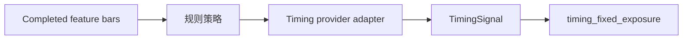

# Timing 子系统

`systems/timing` 保存内置规则择时定义、DataFrame 策略和 provider 适配器。它不是注册 system，也不提供旧 `timing_*` API/CLI。

内置定义包括 SMA、双均线、成交量确认均线、布林均值回归、KDJ、RSI、Stoch RSI、ARBR 和 Aroon。每个 definition 声明参数 Schema、`required_history`、频率、信号类型和部署模式。

策略输出状态/分数，不输出 Broker 订单。历史加载通过 Trading ports；`live_adapter` 把 completed bar 口径接到统一 provider。`target_percent` 属于 PortfolioPolicy，旧策略字段只能在兼容适配时映射。

新增规则策略应先写纯信号测试，再注册 definition；验证历史不足、标的排序、相同 as-of 确定性和 replay/paper/shadow 一致性。
