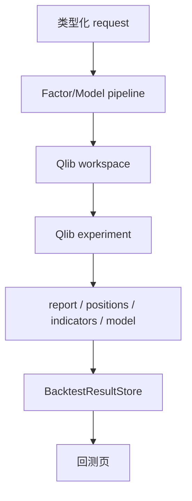

# BacktestSystem

## 职责与非职责

`QlibBacktestSystem` 封装 Qlib qrun、因子/模型评估、工作区和产物读取。它服务研究回测；TradingSystem 的统一 ReplayRuntime 不反向调用旧研究引擎。

## 公共接口

`run_factor_evaluation`、`run_saved_model_evaluation`、`run_factor_experiment`、`run_model_experiment`、`run_workspace`、`delete_workspace` 和 `results`。兼容的 `test_factors/test_model` 将旧 experiment 适配为 request。

`BacktestWorkspace`、`FactorSubWorkspace` 等 Protocol 允许测试和替代执行器，不要求核心依赖具体 Qlib class。

## 产物

workspace manifest、Qlib recorder、组合 report、positions、indicators、factor analysis 和导出模型由 artifacts/results 层统一解析。删除操作必须通过 path safety，不能越过 workspace/log root。

每次运行使用独立 workspace/run tag；Portal job manager 负责子进程并发和取消，System 不把进程内对象当作持久状态。Qlib 失败、产物缺失或反序列化失败应保留 workspace 和结构化错误，不能写成成功摘要。

## 与 Trading Replay 的区别

研究回测用于训练和评估；ReplayRuntime 复用部署侧 provider、policy、sizer、planner、OMS/Risk 和撮合语义。两者可以比较研究结论，但不能宣称成交明细天然等价。

## 适配层、扩展与测试

入口：`alpha_mining`、`strategy_backtest`、Portal jobs/backtests。新增执行器应实现 workspace Protocol 并维持标准 artifact 结构；测试覆盖 pipelines、workspace、artifact 解析、Qlib YAML、费用、并发 run 和删除安全。
