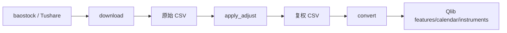

# DataSystem

## 职责与非职责

`QlibDataSystem` 负责 A 股行情下载、复权处理、Qlib 转换、universe 查询和单标的数据维护。它不负责因子表达式、回测或实盘行情。

## 公共接口

`BaseDataSystem` 定义 `download`、`convert`、`get_universe`、`run_action`、`list_symbols`、`delete_symbol`、`trim_symbol`、`refresh_symbol` 和 `storage`。`QlibDataSystem` 还提供 `pipeline`、`apply_adjust` 与单股复权。

类型化入口使用 `DataDownloadCommand`、`DataConvertCommand`、`DataPipelineCommand` 和 `DataActionCommand`；旧参数由 module/API 适配后再进入 system。

## 数据口径

目录来自 `AppConfig.data`。特征数据可以复权；交易 sizing 和成交不能读取这里的复权 close 作为可交易价格，必须经 `HistoricalExecutionDataPort` 或实时行情获得原始报价。PIT 校验和频率规范化位于 data 子包。

## 依赖与错误

系统可以依赖数据源和 Qlib dump 工具，不反向依赖 factor、backtest、trading 或 Portal。下载缺失、日历不齐和复权因子不一致应返回显式失败，不静默混用旧数据。

同一数据目录的写任务应由 job/操作层避免并发覆盖；单股更新通过 storage 抽象落盘，转换完成前不应发布不完整版本。配置、源字段和路径不得进入策略领域契约。

## 适配层、扩展与测试

入口：`platform`、`stock_pool`、Portal data/market API。新增数据源实现下载/规范化适配器并补字段、频率、错误映射；测试覆盖 action dispatch、路径、频率、PIT、单股维护、失败恢复和 Qlib 转换。
