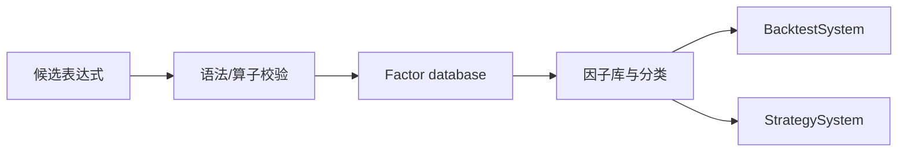

# FactorSystem

## 职责与非职责

`FactorSystem` 管理因子表达式、校验、分类和持久化，是挖掘、研报提取和策略资产之间的资产边界。它不训练模型，也不决定组合权重。

## 公共接口

`BaseFactorSystem` 提供 import、validate/evaluate、CRUD、分类和导出。实现层的 `FactorValidationResult` 返回稳定 code、message 和 details，调用方不能只依赖异常字符串。

`add_factor` 可附带 categories 和 research metadata；`verify_factor_asset` 校验冻结研究元数据 sidecar。批量删除只持久化一次，避免循环写库产生中间状态。

## 持久化与扩展

后端由 `ALPHAPILOT_FACTOR_DB_BACKEND` 和 `ALPHAPILOT_FACTOR_ZOO_DIR` 控制。loader 负责 JSON/外部格式，regulator 负责表达式接受规则。新增算子时应同时更新表达式解析、校验、Qlib 映射和测试。

仓库写入使用完整记录替换/一次性持久化，调用方不应并发编辑底层文件。导入失败、sidecar 指纹不一致和重复名称必须显式报告，不能部分提交分类或 metadata。

## 边界

LLM 输出、OCR 草稿和 AlphaForge 表达式必须先校验再保存。表达式可解析不等于无未来数据或可交易，PIT/IC/成本验证在研究层完成。

## 适配层、扩展与测试

入口：`factor` 模块、`alpha_mining`、`report_factor` 和 Portal `/api/factors`。测试覆盖校验码、分类、并发/批量持久化、重复检测、资产指纹和导入导出。
