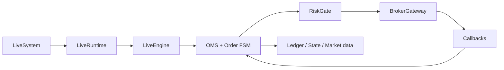

# LiveSystem

## 职责与非职责

`LiveSystem` 负责构建交易运行时、Broker/行情插件、OMS、RiskGate、ledger、恢复和 daemon 控制。策略定义、实例参数、独立部署配置和自动路由授权属于 TradingSystem；中性诊断或研究验收不会修改这些权限。

## 工厂接口

`make_broker`、`create_engine`、`create_paper_engine`、`create_runtime`、`runtime_control`、`broker_uat_harness`、`modes` 和 `snapshot`。`LiveConfig` 分离 trade broker、quote provider、execution environment、risk、ledger/state 和 market data。

## 运行与恢复

daemon 通过 IPC 接收人工运维和 DeploymentCoordinator 命令。连接 FSM、session FSM、order FSM 和 run-mode FSM 管理状态。断线、未知订单、缺失回报或投影损坏必须 halt；恢复先查询 Broker 并对账，不根据本地 JSON 猜测终态。

Broker callback 进入单一事件循环更新 OMS；调用线程不能直接改订单终态。ledger 先记录不可变事件，再更新 runtime projection。跨进程命令通过 runtime ID、心跳和状态版本判断是否仍指向同一个 daemon。

## 行情订阅边界

`LiveEngine` 将实例 universe 分类为 `strategy_symbols`，将 standalone daemon 启动标的和运行期显式新增标的分类为 `observer_symbols`。两者都可录制行情并生成 K 线，但策略 Runner 必须在 listener 和消费入口按固定 universe 各过滤一次。

动态 observer 通过 daemon IPC 逐标的订阅，最多 50 个，不变更 `config_hash`、`binding_hash`、部署生命周期或路由授权。重连时先恢复 strategy，再恢复 observer；strategy 失败必须 fail closed，observer 失败只写诊断。

## 订单边界

人工、自动和 UAT 使用不同 `RouteOrigin`。所有订单经过交易日/时段、合约、行情、价格、整手、资金、持仓、集中度和频率限制。kill switch 阻止新订单但不阻止撤单。

## 插件

Broker 插件通过独立 pip 包注册 gateway、行情、必填环境字段、版本和 artifact hash。插件属于可信代码；核心不得静态导入 XTP/EMT/TTS SDK。详见[实盘插件](../../live-plugins.md)。

## 适配层、扩展与测试

入口：`live` module、Portal `/api/live` 和 TradingSystem runtime ports。新 Broker 必须经插件 registry 实现 gateway/quote 契约和脱敏诊断；测试覆盖 PAPER、回调乱序、部分成交、撤单、重连、状态恢复、脱敏和受保护 UAT simulator。
