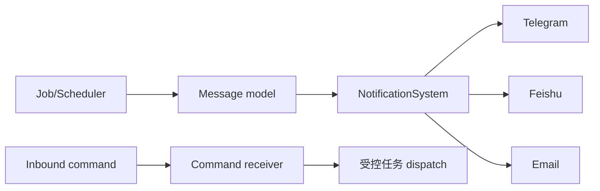

# NotificationSystem

## 职责与非职责

`NotificationSystem` 是消息发送能力的 system facade，实际渠道实现位于 `channels`。它不管理 Portal job，也不决定何时发送业务通知。

## 接口

`send(Message)`、`test_send(channel)` 和 `configured_channels()`。消息构建器把 daily signals 和 job result 转换为渠道无关内容。渠道实现 `is_configured` 和 `send`。

## 配置与安全

配置来自权限受限文件和 `ALPHAPILOT_NOTIFY_*` 环境变量。API/日志只显示掩码。Inbound receiver 必须校验白名单、配对码和渠道签名；文件浏览命令需要路径边界检查。

渠道发送失败返回明确结果，由调用 job 决定重试；System 不无限重试或把失败吞掉。receiver 的轮询/回调线程不能直接进入 Broker 路由，业务命令仍需经过 Portal/module 权限边界。

## 扩展

新增渠道：实现 channel base，加入 registry/config schema，补发送和缺失凭据测试。不要让渠道 SDK import 失败阻止未使用渠道或主进程启动。

## 适配层与测试

入口：Portal `notify` API、scheduler/job completion 和 `notify_commands`。测试默认 capture message，不发送外部网络；覆盖缺失配置、脱敏、provider 异常和接收白名单，真实通知使用 `real_notify` marker。
