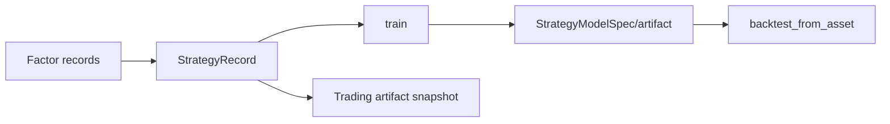

# StrategySystem

## 职责与非职责

`StrategySystem` 保存研究策略资产：因子公式、模型说明、训练 artifact、Qlib 参数、指标和元数据。它不是运行时策略 registry，也不持有实盘生命周期。

## 主要类型

- `StrategyRecord`：名称、因子、模型、参数、指标和 metadata。
- `StrategyModelSpec`：模型名、hyper params、训练 artifact URI 和 fitted params。
- `StrategyBacktestRequest/Outcome`：策略资产复测的输入与输出。

公共方法包括 import、train、register、从因子创建、查询/列表/删除、`train_and_register` 和 `backtest_from_asset`。

## 持久化

参数库目录由 `AppConfig.strategy.param_dir` 管理。研究资产允许继续编辑或新建版本；TradingSystem 导入时会复制必要文件并生成不可变 manifest，之后不得继续引用可变原路径。

资产写入应先完成模型/artifact 校验再发布 record；失败的训练不得覆盖已存在的可用版本。并行训练使用独立 workspace，最终注册阶段处理名称冲突和 metadata 指纹。

## 依赖边界

该系统可以调用 BacktestSystem 完成训练/复测，并读取 FactorSystem 解析因子；不能调用 LiveSystem 或 Broker。自动实例不能直接使用用户传入的 `model_pickle_path`。

## 适配层、扩展与测试

入口：`strategy_backtest`、Portal `/api/strategies` 和 TradingSystem 研究资产导入。新增模型通过 model spec/BacktestSystem 适配，不在资产仓库中引入 Broker 依赖；测试覆盖 record 序列化、模型 artifact、从因子创建、复测、失败发布和导入导出。
