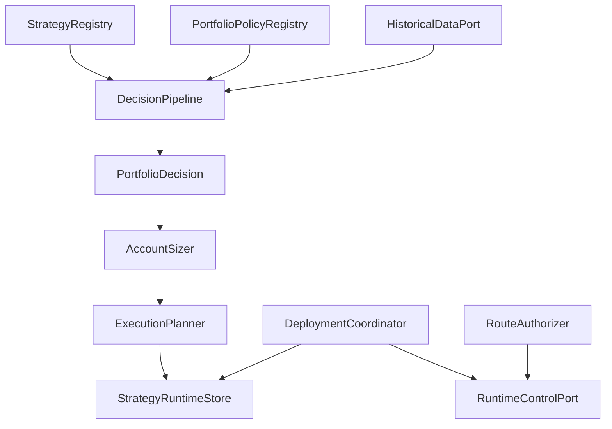

# TradingStrategySystem

## 职责与非职责

`TradingStrategySystem` 是“定义/实例 → 信号 → 权重 → 账户目标 → 执行计划 → 部署”的应用层。它只依赖 ports 访问数据和运行时，不直接构造 Broker 订单。

## 公共契约

`contracts.py` 包含 `CompletedBar`、`TradableQuote`、`InstrumentMetadata`、三类信号、`PortfolioInputs`、`TargetWeights`、`PortfolioDecision`、`AccountSnapshot`、`TargetPortfolio` 和 `ExecutionPlan`。这些类型不得导入 live/timing/backtest 实现。

`ports.py` 定义历史数据、交易日历、合约、账户快照、执行路由、runtime control 和自动授权边界。

## 服务能力

- 定义/政策列表和实例 CRUD/校验。
- 研究资产 artifact 快照。
- preview、异步 replay、详情和取消。
- execution binding、晋升、一次性 LIVE approval。
- start/pause/reconcile/resume/stop 协调。
- kill switch、审计、parity、qualification、兼容历史和 UAT 只读结果。

Stage run 的开始、会话计数和结束只能由 DeploymentCoordinator/runtime 驱动。公共 service 和 CLI 不暴露手工写入包装；Store 方法属于内部持久化协议。

## 持久化与确定性

SQLite WAL 使用顺序 migration，保存实例、artifact、decision provenance、backtest、deployment、stage、parity、plan/order/fill、operator 和 UAT。相同 `as_of + history_hash` 复用已保存决策；同一 as-of 的不同历史哈希拒绝覆盖。

`decision_id`、稳定订单引用和单账户 LIVE writer 由唯一约束保证并发幂等。迁移在备份后的单事务中执行；迁移、状态恢复或 Broker 对账失败时保留数据并关闭自动路由。

## 安全

自动授权绑定实例、配置哈希、账户、Broker、模式、生命周期和心跳。同一账户只有一个 LIVE writer。配置或 artifact 变化会失效证据和授权。SHADOW 使用真实输入但 route port 永久不可路由。

测试覆盖契约序列化、依赖边界、provider、回放一致性、执行恢复、授权、迁移、parity、qualification 和 deployment fail-closed。

## 适配层与扩展

CLI、Portal 和 HTTP 只做参数/认证适配，正式运行由 `DeploymentCoordinator` 驱动。新 provider、policy、数据源或 runtime 通过 registry/Protocol 扩展；核心 `contracts/application` 禁止反向导入 timing、selection、live 或 Portal 具体实现。
