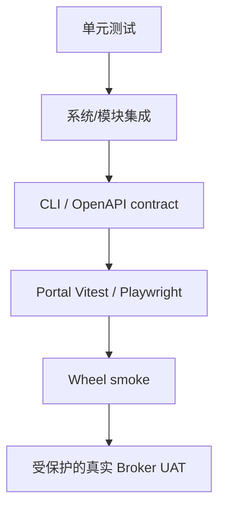

# 测试与贡献

## 分层



默认 `pytest` 排除真实数据、真实 LLM、慢任务、真实通知和 TTS。只有显式 marker 和凭据隔离环境才允许外部调用。

## 常用命令

```bash
pytest
pytest tests/test_cli_contract_matrix.py tests/test_portal_openapi_contract.py

cd alphapilot/modules/portal/web
npm test
npm run typecheck
npm run build
npm run test:e2e
```

文档：

```bash
python scripts/generate_docs_reference.py --check
pytest tests/test_documentation.py
```

## 隔离要求

- 测试写入 `tmp_path` 或 `git_ignore_folder/qa`，不能复用用户 runtime DB、ledger 或策略状态。
- `tests/test_*.py` 必须能被 pytest 收集；需要人工启动、联网或输出性能报告的诊断工具放在 `scripts/`，不要伪装成测试文件。
- 普通 CI 不读取 `.env` 中的券商账号，不连接真实 Broker。
- XTP、EMT、TTS UAT 使用专用受保护工作流、白名单和金额上限；日志必须脱敏。
- 测试结束必须确认没有活动委托、daemon 或未解决对账差异。

当前数据诊断工具：

```bash
python scripts/compare_tushare_adjust.py --help
python scripts/benchmark_factor_probe_download.py --help
```

二者都需要显式人工启动，不属于默认 pytest 测试集。

## 修改契约

新增/删除 CLI、HTTP、Portal 页面、系统或模块时：

1. 修改对应 contract snapshot。
2. 更新 `docs/catalog.json`。
3. 运行参考生成脚本并提交输出。
4. 更新用户和开发文档、截图或迁移说明。
5. 破坏性删除要验证旧入口无调用并保留历史审计数据。

不要通过降低测试数量、覆盖率或手工修改生成文件绕过失败。
