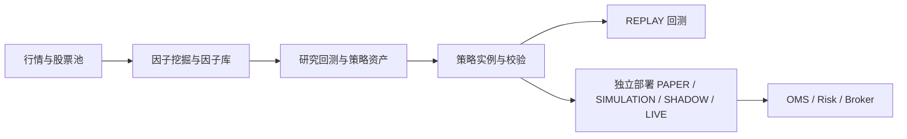

# AlphaPilot 文档中心

本文档以当前 `0.2.x` 代码为准。日常使用先看用户手册，二次开发和插件接入看开发文档；完整命令和接口由代码自动生成。

## 用户手册

1. [快速开始](user/getting-started.md)
2. [Portal 使用总览](user/portal-overview.md)
3. [数据与股票池](user/data-and-pools.md)
4. [因子挖掘与因子库](user/factor-mining-and-library.md)
5. [策略资产与研究回测](user/strategy-assets-and-backtests.md)
6. [策略实例、预览和统一回测](user/strategy-instances.md)
7. [每日交易与滚动会话](user/daily-trade.md)
8. [模拟与实盘交易](user/live-trading.md)
9. [调度、通知与运维](user/scheduling-notifications-and-operations.md)

## 开发文档

- [开发文档首页](developer/index.md)
- [内核、注册与插件](developer/kernel-and-plugins.md)
- [Portal 与 HTTP API](developer/portal-and-api.md)
- [自定义策略与组合政策](developer/strategy-extension.md)
- [测试与贡献](developer/testing.md)
- [组件覆盖矩阵](reference/components.md)

## 自动生成参考

- [117 个内置 CLI 命令](reference/cli.md)
- [Portal 页面功能矩阵](reference/portal-capabilities.md)
- [HTTP API 完整索引](reference/http-api.md)
- [系统、模块与文档映射](reference/components.md)

## 专题与部署

- [策略到交易全链路](strategy-trading-full-chain.md)
- [策略实例、注册与实盘部署](strategy-runtime.md)
- [XTP Pro / EMT 接入](live-xtp.md)
- [OpenCTP TTS 柜台仿真](tts-simulation.md)
- [实盘插件开发](live-plugins.md)
- [Docker 部署](DOCKER.md)
- [0.2.0 历史迁移记录](strategy-trading-migration-0.2.md)

> 自动策略 LIVE 默认关闭。文档中的 PAPER、SHADOW、UAT 和 LIVE 只证明运行链路与安全约束，不代表策略具有盈利能力。
