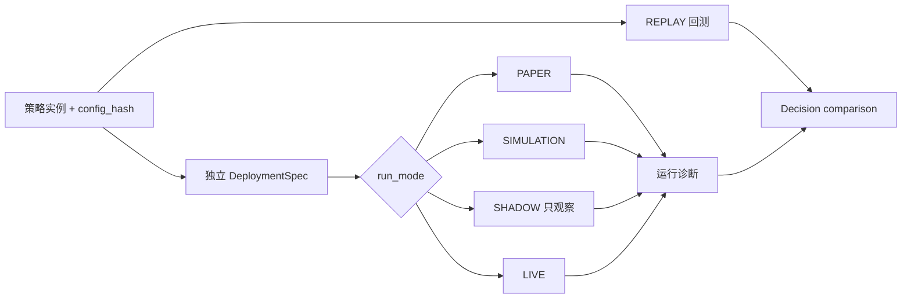

# 策略交易链路破坏性升级记录

> 本页记录历史接口的删除结果和 schema v10 的切换方式，不是日常操作教程。当前用法请查看[策略实例用户指南](user/strategy-instances.md)、[模拟与实盘指南](user/live-trading.md)和[HTTP API 参考](reference/http-api.md)。

## 当前结论

策略实例与部署已经彻底拆分：实例只描述代码、参数、因子、模型、股票池和政策；REPLAY 是实例上的回测操作。部署单独保存 `paper | simulation | shadow | live` 模式、Provider、账户绑定和运行状态。

系统不再包含 `REPLAY → PAPER → SHADOW → LIVE` 晋级状态机，也不存在系统级 LIVE qualification、临时 approval、人工账户 baseline 或阶段证据。PAPER/SHADOW 会话、通用 decision comparison 和 Broker UAT 都是诊断事实，不会授予或撤销部署权限。

## 已删除的公共接口

以下 CLI 已从命令注册表删除，不提供兼容别名：

- `trading_promote`
- `trading_authorize_live`
- `trading_qualification`
- `trading_parity_start`、`trading_parity_status`
- `trading_bind_execution`、`trading_execution_binding`
- 手工 stage start/finish/evaluate 命令

对应的 promotion、authorize-live、qualification、parity、execution-binding 和 stage-run HTTP 写接口也已删除。未知 `/api/*` 路径返回 404，不会被 Portal 的单页应用回退页吞掉。

替代入口为：

| 能力 | CLI | HTTP |
|---|---|---|
| 配置或替换部署 | `trading_deploy` | `PUT /api/trading/deployments/{instance_id}` |
| 列出部署 | `trading_deployments` | `GET /api/trading/deployments` |
| 查看运行诊断 | `trading_diagnostics` | `GET /api/trading/deployments/{instance_id}/diagnostics` |
| 比较两次决策 | `trading_decision_compare` | `POST /api/trading/deployments/{instance_id}/decision-comparisons` |
| 查询比较结果 | `trading_decision_comparisons` | `GET /api/trading/decision-comparisons/{comparison_id}` |
| 生命周期 | `trading_{start,pause,reconcile,resume,stop,status}` | `/api/trading/deployments/{instance_id}/{action}` |

所有 `/api/live` 与 `/api/trading` 写接口统一遵循 Portal operator-auth 模式。默认 `required` 必须提供 Operator Bearer；本机 `portal_operator_auth` CLI 可显式切换到高风险 `optional`，无令牌请求按 `portal-unauthenticated` 审计。部署接口不再限制 loopback，Broker UAT HTTP 仍保持只读。

## schema v10 切换

v10 将以下事实分别持久化：

- 策略实例及验证状态；
- 部署配置与不可变 `binding_hash`；
- 部署 runtime、心跳、writer lock 与对账状态；
- PAPER/SIMULATION/SHADOW/LIVE 运行和中性诊断；
- 通用决策比较及逐交易日结果。

v1–v9 runtime SQLite 不会自动迁移。进程检测到旧 schema 时，会在任何写入前报错并保持原文件字节不变。切换步骤如下：

1. 停止所有策略 daemon，并保留旧 SQLite 作为只读历史文件。
2. 将 `ALPHAPILOT_STRATEGY_RUNTIME_STORE` 指向一个全新的路径。
3. 启动 AlphaPilot，由系统创建 schema v10。
4. 重新创建或导入实例，执行实例验证，再通过 `trading_deploy` 或 HTTP `PUT` 配置部署。

不要把旧数据库复制到新路径后尝试启动，也不要删除旧文件来掩盖错误。需要历史审计时，应在隔离环境中以旧版本只读查看。

## LIVE 行为变化

经过验证的实例可以直接配置 LIVE，不要求事先产生 PAPER/SHADOW/UAT/approval 记录。这个变化只删除晋级门禁，不降低运行安全：

- 必须设置 `ALPHAPILOT_AUTOMATED_LIVE_ENABLED=true`；
- 部署必须绑定真实交易 Provider、实时行情 Provider 和账户；
- `config_hash`、`binding_hash`、runtime 与实际账户必须一致；
- 同一账户只能有一个 writer；
- 合约、行情新鲜度、心跳、Kill Switch 和逐单 RiskGate 继续 fail closed；
- LIVE 每次启动后先完成 reconcile，再显式调用 `resume` 才能路由；
- SHADOW 永久禁止路由。

实例参数、模型、因子、股票池或政策变化后，原部署会保留但标记为 `stale`。必须重新验证实例，并在 daemon 停止后再次 `PUT`，把部署绑定到新的 `config_hash`。

## 研究 campaign 与 UAT

研究 campaign 可以继续要求 20 个 PAPER 日、5 个 SHADOW 日、决策一致性、Broker UAT 或其他阈值，但这些条件只属于该 campaign 的验收政策。campaign 从运行诊断、通用 decision comparison 和 UAT 证据读取事实，不得调用部署晋级接口，也不得改变 LIVE 授权。

Broker UAT 仍可能产生真实委托，只能通过受保护的本机流程运行。凭据必须放在权限受限的 secret 文件或进程环境中，不得写入 CLI 参数、数据库、日志或产物。低层 `/api/live` 手工交易及其 `confirm_live` 机制不受本次升级影响。

## 回滚边界

这是破坏性升级，没有 v10 → v9 数据回滚或双写模式。需要回到旧版本时，必须同时切回旧程序和原来的旧版 SQLite；不得让旧程序打开 v10 store，也不得让新程序打开 v1–v9 store。
