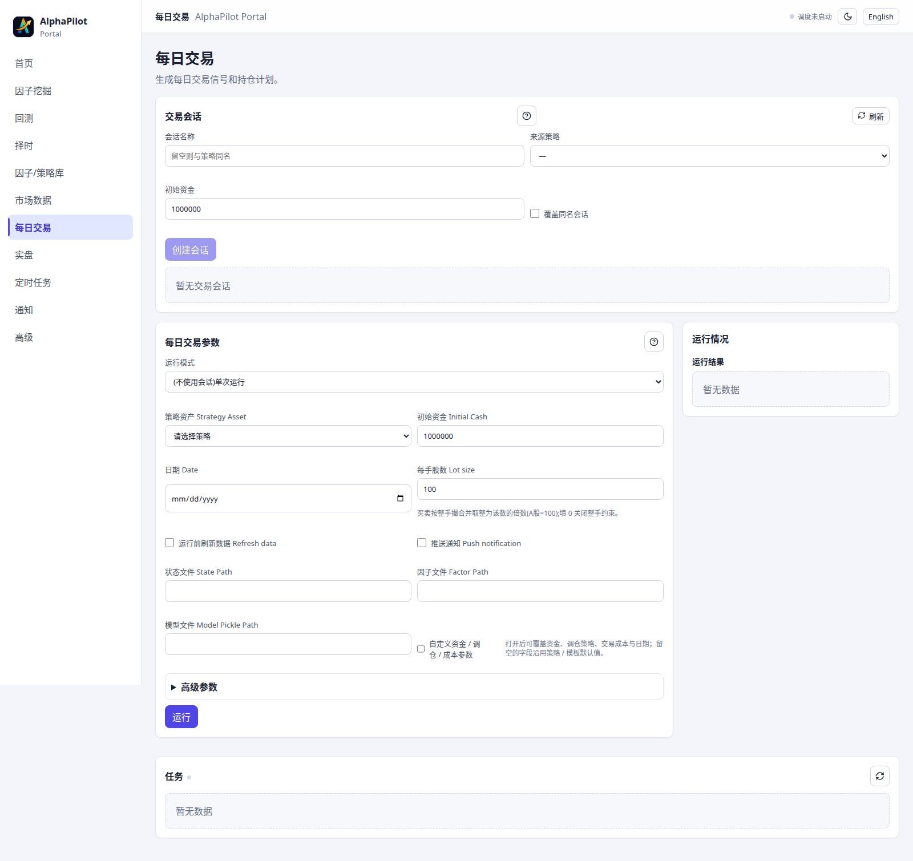

# 每日交易与滚动会话

该功能用于研究侧按交易日推进的独立模拟账户，不等同于正式策略实例部署。正式自动交易请使用 `trading_*` 与 deployment。

## 适用场景与前置条件

适合研究人员按日观察已保存模型的信号、模拟持仓和净值变化。开始前需要一个可读取的研究策略资产、相应日期的数据和可写的 trade-session 目录；它不要求 Broker 连接。


Portal 的“每日交易”页可以创建/选择会话、调整模拟资金、推进交易日并查看历史；CLI 适合脚本化推进。



## 创建会话

```bash
alphapilot trade_session_create \
  --name=demo_session \
  --strategy_name=demo_lgb \
  --init_cash=500000
alphapilot trade_session_show --name=demo_session
```

会话保存策略快照、滚动账户状态和每日历史。原策略资产后续变化不会静默改变已有会话。

## 生成每日信号

```bash
alphapilot daily_signals --session=demo_session --date=2026-07-16
alphapilot trade_session_history --name=demo_session
```

不要重复推进同一交易日；需要修复状态时先备份会话目录并核对历史。`refresh_data=True` 会先触发数据更新，耗时和失败边界与数据系统相同。

## 调整模拟现金

```bash
alphapilot trade_session_cash \
  --name=demo_session --amount=10000 --note="研究账户入金"
```

正数为入金，负数为出金。该操作只改变研究会话，不会触发 Broker 资金操作。

## 输出

- manifest：会话名、策略快照和初始配置。
- state：现金、持仓和最近推进日期。
- history：每日交易、NAV、收益、费用和换手率。

## 与正式链路的边界

`daily_signals` 仍允许人工传入模型路径等研究参数，适合复验和人工计划；它不能直接作为自动部署配置，也不授予路由权限。要进入正式 PAPER、SIMULATION、SHADOW 或 LIVE 部署，应把研究资产导入策略实例，由统一 pipeline 按对应账户快照重新 sizing。

## 安全提示与常见错误

- 日期重复或倒退：先检查 session history，不要手工删掉单日记录后继续推进。
- 模型或因子文件变化：已有 session 使用创建时快照；需要新版本时新建会话。
- 余额不足或整手后无交易：这是模拟账户 sizing 结果，不应通过修改历史文件绕过。
- `trade_session_cash` 仅用于研究调整，不能代表真实入金或形成部署证据。
