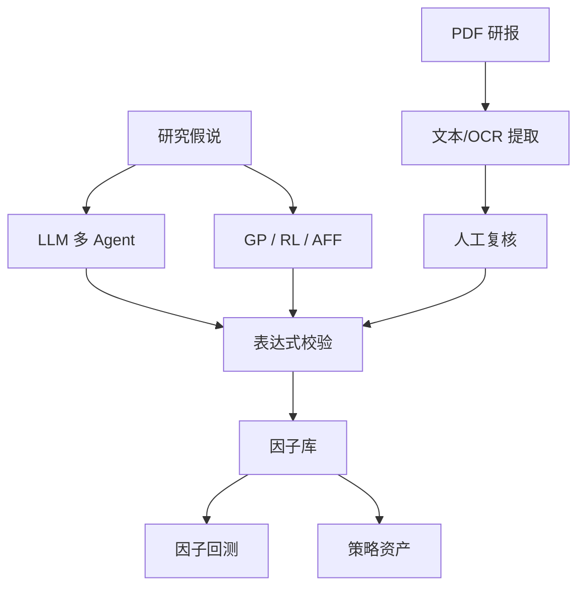

# 因子挖掘与因子库

## 适用场景与前置条件

用于从研究假说、公式搜索或研报中产生候选因子，并经过人工复核后写入因子库。LLM 路径需要模型配置，GP/RL/AFF 需要相应可选依赖，所有路径都需要可用的 Qlib 数据才能完成有效评估。

## 能力关系




## LLM 因子挖掘

```bash
alphapilot mine \
  --direction="成交量异常与短期反转" \
  --step_n=5 --market=csi300 \
  --save_factors_to_library=True
```

`mine` 会创建独立会话目录，保存研究假说、模型输出、代码、评估和日志。恢复任务时应使用已有会话路径，不要直接改中间 pickle。

```bash
alphapilot list_mine_logs
alphapilot list_runs
```

## 非 LLM 公式搜索

```bash
alphapilot mine_gp --instruments=csi300 --generations=5 --population_size=200
alphapilot mine_rl --instruments=csi300 --steps=10000
alphapilot mine_aff --instruments=csi300 --zoo_size=20
```

这些命令需要 `alphaforge` 可选依赖。候选表达式仍需经过 AlphaPilot 因子校验；`--save=False` 可只观察结果。

## 因子库管理

```bash
alphapilot factor_validate --expression='Ref($close, 1) / $close - 1'
alphapilot factor_add \
  --factor_name=one_day_reversal \
  --expression='Ref($close, 1) / $close - 1' \
  --categories=price,reversal
alphapilot factor_list --category=reversal
alphapilot factor_duplicates --similarity_threshold=0.8
```

Portal 的“因子与策略库”还支持批量分类、删除、导入、导出和因子回测：


## 研报 PDF/OCR

1. 上传 PDF。
2. 选择可用的文本或 OCR provider。
3. 后台提取候选因子草稿。
4. 人工检查名称、表达式、依据和页码。
5. 先校验，再显式提交选中的草稿。

上传文件和草稿不会自动进入因子库。OCR provider 不可用时应停止，不要把不完整识别结果直接提交。

## 输出与边界

- 因子库保存表达式、分类和研究元数据；模型训练结果属于策略资产。
- 因子通过语法校验不代表有效或无未来数据，仍需 PIT、IC、稳定性和交易成本验证。
- LLM 及本地策略插件属于可信代码边界；Portal 不支持上传任意 Python 后立即执行。

输入包括研究方向、市场、训练区间、随机种子和可选研报；产物包括会话日志、候选表达式、评估结果、草稿及经确认写入的因子记录。Portal 与 CLI 调用相同系统能力，但 PDF/OCR 的逐条复核更适合 Portal。

## 安全提示与常见错误

- 模型或 OCR provider 不可用：保留失败日志并停止提交草稿，不要用空结果覆盖因子库。
- 表达式校验失败：根据返回的 code/message 修正字段、函数或窗口。
- 结果无法复现：固定数据版本、模型版本、prompt/seed，并保留 session/run ID。
- 高 IC 但上线失效：检查未来数据、幸存者偏差、换手率和费用；语法通过不代表可交易。
