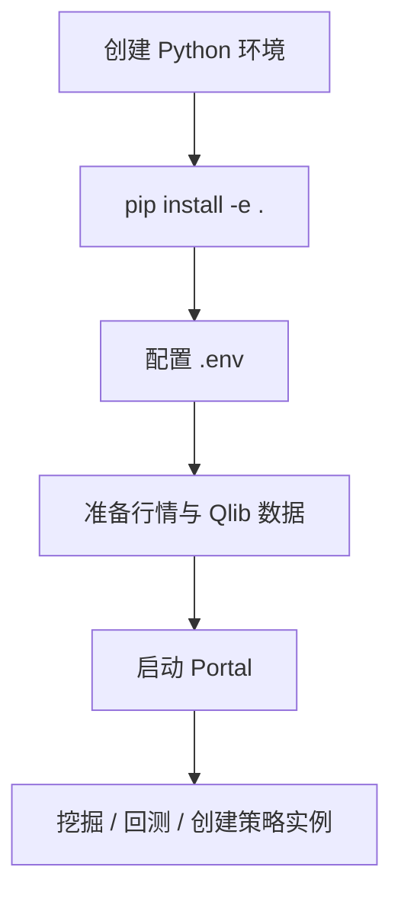
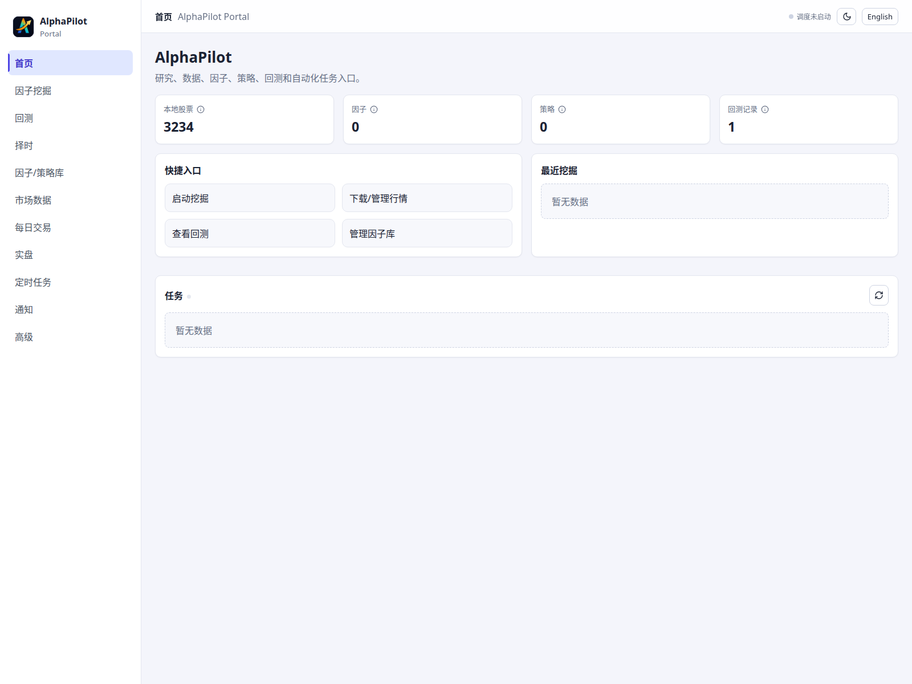

# 快速开始与环境准备

## 适用场景

本页用于第一次安装 AlphaPilot，并跑通“准备数据 → 启动 Portal → 执行研究任务”的最短闭环。Python 建议使用 3.11；Node.js 只在开发或重新构建 Portal 前端时需要。

## 前置条件

- Linux 或兼容的开发环境，Python 3.11 与 Git 可用。
- 至少准备一份股票列表；需要下载数据时配置相应数据源凭据。
- 因子挖掘、通知和实盘插件按需安装，不是启动 Portal 的前置条件。



## 安装

```bash
conda create -n alphapilot python=3.11
conda activate alphapilot
pip install -e .
```

需要重新构建 Portal 时：

```bash
cd alphapilot/modules/portal/web
npm install
npm run build
cd ../../../..
```

复制配置模板并只填写实际需要的凭据：

```bash
cp .env.example .env
chmod 600 .env
```

LLM 挖掘通常需要 `OPENAI_API_KEY`、`OPENAI_BASE_URL`、`CHAT_MODEL` 和 `REASONING_MODEL`；Tushare、通知和券商插件分别使用自己的环境变量。不要把 `.env`、券商账号、token 或模型私有文件提交到 Git。

## 准备数据

最短数据流水线：

```bash
alphapilot prepare_data pipeline \
  --stock_csv=important_data/stock_lists/main_stock_2026_4_27.csv \
  --adjust_mode=backward
```

也可以拆成 `download`、`apply_adjust` 和 `convert`。完成后在 Portal 的“行情数据”页检查标的列表和 K 线；详细参数见[数据与股票池](data-and-pools.md)。

## 启动和检查 Portal

```bash
alphapilot portal
```

默认打开 `http://127.0.0.1:19901`。除非前面另有反向代理和认证层，不要监听公网地址。



CLI 采用 Python Fire：

```bash
alphapilot modules
alphapilot trading_definitions
alphapilot live_status
alphapilot prepare_data -- --help
```

通用形式是 `alphapilot <命令> --参数=值`；复杂对象使用 JSON 字符串，布尔值显式写成 `True` 或 `False`。完整清单见 [CLI 参考](../reference/cli.md)。

## 最小任务

任选一个不会路由真实订单的任务：

```bash
# LLM 因子挖掘
alphapilot mine --direction="行为金融学假说" --step_n=3

# 或本地 PAPER daemon
alphapilot live_daemon_start --mode=paper --symbols=600000.SSE --cash=100000
alphapilot live_daemon_status --mode=paper
alphapilot live_daemon_stop --mode=paper
```

## 输入、输出与安全

- `important_data/`：股票列表、股票池、因子库、策略资产和模板。
- `git_ignore_folder/`：运行状态、回测工作区、账本、缓存和临时产物。
- `log/`：挖掘及应用日志。
- `strategies/`：经过显式清单注册的本地自定义策略代码。

输入主要来自 `.env`、股票列表和命令参数；输出写入上述目录。第一次运行前确认这些目录可写，并把 `.env`、`git_ignore_folder/` 和私有 artifact 排除在版本控制之外。快速开始中的命令均不会连接真实 Broker；真实路由需另行完成[模拟与实盘](live-trading.md)中的部署配置、环境开关和安全检查。

## 常见问题

- 命令不存在：确认已执行 `pip install -e .`，再用 `alphapilot modules` 查看模块。
- Portal 只有空壳：先在前端目录执行 `npm install && npm run build`。
- Qlib 找不到数据：核对 `.env` 中的数据目录与 `prepare_data` 输出是否一致。
- 任务一直等待：在 Portal 查看后台 job 日志，不要重复提交相同交易命令。
