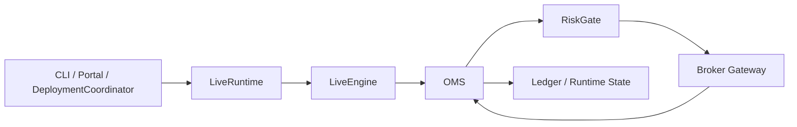
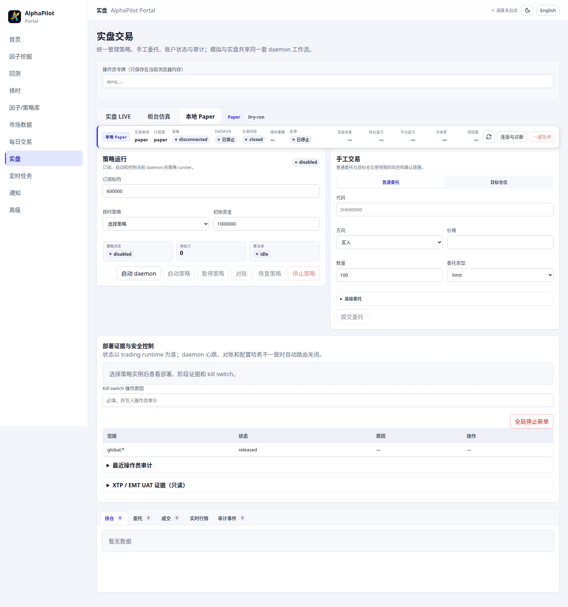

# 模拟与实盘交易

> **风险提示：** 默认保持 `ALPHAPILOT_AUTOMATED_LIVE_ENABLED=false`。即使部署不再要求逐级晋升，也应在确认风控、账户绑定、行情、对账和恢复流程后才启用真实路由。

## 适用场景与前置条件

用于 PAPER 演练、仿真柜台、SHADOW 观察、人工运维和受控 LIVE 部署。PAPER 只需本地环境；simulation/live 需要对应插件、受限账户、合约与行情能力。自动策略必须有已验证实例和匹配当前配置哈希的独立部署。

## 运行边界



| 模式 | 数据/账户 | 可路由 | 用途 |
|---|---|---:|---|
| `dry_run` | 本地 | 否 | 只规划 |
| `paper` | 本地模拟 | 仅 PaperBroker | 功能演练 |
| `simulation` | 外部仿真柜台 | 按插件配置 | TTS 等柜台仿真 |
| `shadow` | 真实只读 | 否 | 与 LIVE-plan 一致性验证 |
| `live` | 真实 | 受授权控制 | 小规模实盘 |



## 最安全的开始方式

```bash
alphapilot live_status
alphapilot live_plugins
alphapilot live_preflight --broker=paper
alphapilot live_daemon_start \
  --mode=paper --symbols=600000.SSE --cash=100000
alphapilot live_daemon_status --mode=paper
```

结束时：

```bash
alphapilot live_daemon_stop --mode=paper
```

## 人工订单和目标组合

人工订单与自动策略授权分离，并记录 `origin=manual`：

```bash
alphapilot live_daemon_order \
  --mode=paper --symbol=600000.SSE --side=buy \
  --volume=100 --price=10.00
```

`live_submit_target`/`live_daemon_submit_target` 可以只生成计划或显式路由。涨停卖、跌停买是否被接受由合约涨跌停、价格步长、行情新鲜度和 RiskGate 决定，不受 Broker UAT 工具的 ±1% 挂单场景限制。

## Portal 操作员鉴权

Portal 默认在所有 `/api/live` 和 `/api/trading` 写操作上要求操作员令牌；命令行交易本身继续使用 `local-cli` 审计，不受这个 Portal HTTP 开关影响。查看或切换模式：

```bash
alphapilot portal_operator_auth
alphapilot portal_operator_auth \
  --required=false \
  --operator_id=alice \
  --reason="trusted lab network" \
  --acknowledge_network_risk=true
alphapilot portal_restart
```

`optional` 模式不会关闭确认、账户绑定、对账、单账户 writer lock、Kill Switch、RiskGate 或 automated LIVE 环境开关，但它会允许无令牌客户端调用策略、部署、daemon、Kill Switch 和手工订单接口。若 Portal 监听 `0.0.0.0`，通配 CORS 还允许跨站网页发起请求。启动日志、实盘/策略页面和 `/api/portal/security` 会持续显示警告；通用审计记录 request ID、路径、方法、结果、客户端地址、Origin 与 User-Agent，不记录凭据或请求载荷。

## 自动策略部署

正式部署只接受持久化 `instance_id`：

```bash
alphapilot trading_deploy --instance_id=ma_5_20 --run_mode=paper
alphapilot trading_start --instance_id=ma_5_20
alphapilot trading_status --instance_id=ma_5_20
alphapilot trading_pause --instance_id=ma_5_20
alphapilot trading_reconcile --instance_id=ma_5_20
alphapilot trading_resume --instance_id=ma_5_20
alphapilot trading_stop --instance_id=ma_5_20
```

LIVE 重启后固定进入 `PAUSED_PENDING_RECONCILE`，不会自动恢复下单。pause/stop 会尽力撤销实例活动订单并撤销路由授权。

## Kill switch

```bash
alphapilot trading_kill_switch \
  --scope_type=instance --scope_id=ma_5_20 \
  --active=True --reason="manual halt"
```

支持实例、账户和全局三级。启用后阻止新订单，但撤单始终允许。解除前必须记录操作员和原因。

## SHADOW、诊断和 UAT

- SHADOW 使用真实账户和行情生成与 LIVE 相同的目标及计划，路由端口永久关闭。
- `trading_diagnostics` 汇总各运行模式的会话和异常；`trading_decision_compare` 可比较任意两次回放/部署运行。二者都不改变部署权限。
- XTP/EMT/TTS UAT 只能由本地 `trading_broker_uat_*` CLI 发起，且受白名单和金额上限约束；它是可选验收工具，不是 LIVE 门禁，也不限制普通用户和策略委托价格。

券商安装和环境变量见 [XTP/EMT](../live-xtp.md)、[TTS](../tts-simulation.md) 和[插件开发](../live-plugins.md)。

## 输入、输出与审计产物

输入包括 workspace、Broker/行情源、账户、标的、订单或目标组合。输出包括 runtime state、不可变 ledger、OMS 委托/成交、部署配置、运行诊断、可选决策比较/UAT 和操作员审计。状态 JSON 是投影，Broker 查询与 SQLite/ledger 才共同构成恢复依据；不要单独编辑任一文件。

## Fail-closed 条件

Broker 断线、账户未同步、行情过期、合约缺失、停牌、状态损坏、未知外部订单、撤单失败或配置哈希变化都会阻断自动路由。不要通过手工改 SQLite 或状态 JSON 绕过阻断。

## 常见错误

- daemon 无法启动：先运行 preflight，核对插件、native SDK、环境字段和端口。
- 订单被拒：查看 RiskGate 原因、合约价格边界、交易单位、现金和交易时段。
- 重启后不能恢复：这是预期的 fail-closed 行为，应先 reconcile 再人工 resume。
- SHADOW 有计划但无委托：SHADOW 永久 `can_route=False`，不是故障。
- optional 模式仍返回 401：请求主动携带了无效或过期令牌；清除该令牌，或换成有效令牌以保留真实操作员身份。
