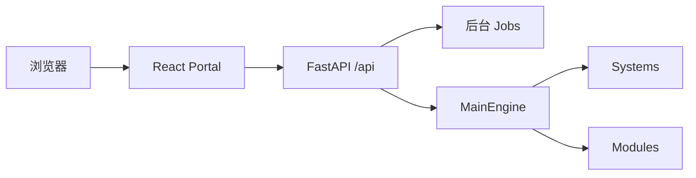

# Portal 使用总览

Portal 是系统和模块的统一操作界面，不重新实现研究或交易逻辑。CLI 适合脚本和自动化，Portal 适合交互操作、状态观察与人工确认。

## 适用场景与前置条件

适合在本机浏览器完成交互式研究、查看后台任务以及执行需要人工确认的交易操作。启动前应完成基础安装，并确保配置目录、运行目录和前端静态资源可读。真实交易页还要求已安装对应 Broker 插件，但查看其他页面不需要券商账号。



## 启动

```bash
alphapilot portal --host=127.0.0.1 --port=19901
```


## 页面说明

| 页面 | 主要用途 | 常用 CLI |
|---|---|---|
| 首页 | 系统状态、快速入口、最近挖掘 | `modules` |
| 因子挖掘 | LLM、AFF、GP、RL 和会话日志 | `mine`、`mine_aff`、`mine_gp`、`mine_rl` |
| 回测 | 因子/策略回测、图表、排行榜、工作区 | `backtest`、`strategy_backtest` |
| 择时（策略实例） | 定义、政策、实例、preview、统一回测 | `trading_*` |
| 因子与策略库 | 因子、分类、研报提取、策略资产 | `factor_*`、`strategy_*` |
| 行情数据 | 数据任务、单股维护、股票池、K 线 | `prepare_data`、`pool_*` |
| 每日交易 | 滚动研究账户和日频信号 | `trade_session_*`、`daily_signals` |
| 模拟与实盘 | runtime、daemon、订单、部署和安全控制 | `live_*`、`trading_*` |
| 调度 | 任务计划和 scheduler daemon | `scheduler` |
| 通知 | 通知渠道、命令接收和配对 | `notify_commands` |
| 高级设置 | Portal/env 配置、日志清理、模块调用 | `timezone`、`clean_logs`、`modules` |

完整页面截图和功能索引见 [Portal 功能矩阵](../reference/portal-capabilities.md)。

## 操作员令牌

`/api/trading` 写操作需要操作员 Bearer token。先在本机 CLI 生成，明文只显示一次：

```bash
alphapilot trading_operator_token \
  --operator_id=alice --label=portal --expires_in_days=1
```

在“策略实例”或“模拟与实盘”页输入 token。前端只保存在当前内存会话，不写入 `localStorage`；刷新页面后需要重新输入。

## 后台任务

挖掘、数据准备和研究回测通过 job 运行。提交后应在页面查看状态、日志、结果或取消，不要依赖浏览器页面一直打开。策略实例的正式回测使用 `/api/trading/backtest-runs`，与通用 job 状态分开保存。

## 输入、输出与文件产物

Portal 表单最终转换为 HTTP 请求；结果来自系统状态、job 目录、回测工作区和 trading runtime SQLite。浏览器刷新不会删除后台任务，但会清除仅存于内存的操作员 token。下载或导出的 CSV/JSON 是结果副本，不能替代数据库中的审计记录。

## 安全边界

- Portal 默认仅面向本机，不提供完整互联网身份系统。
- UAT 只能从本地 CLI 发起，Portal 只读展示证据。
- `/api/modules/run` 可以调用模块写操作，只应在受信任的本地环境使用。
- LIVE 页面中的计划、路由和人工订单是不同操作；勾选真实路由前必须确认 workspace、Broker、账户和风控状态。

## 常见错误

- 页面持续显示“调度未启动”：先检查 `/api/status` 和 Portal 进程日志。
- 写操作返回 401：重新生成并输入有效的操作员 token。
- 页面数据为空：核对当前 Portal 使用的数据目录是否与 CLI 相同。
- 后台任务失败：打开任务详情查看 stderr/结构化错误，不要反复提交相同任务。
