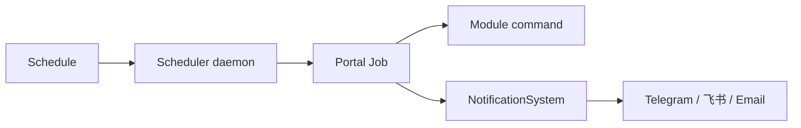
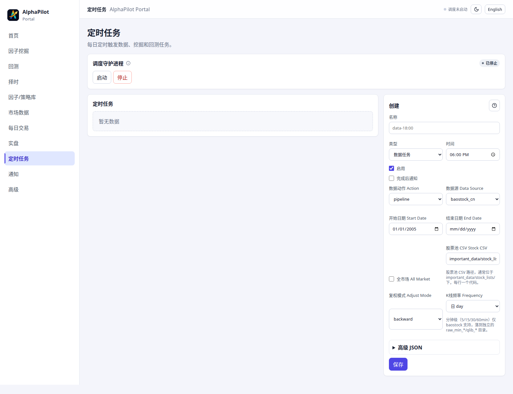
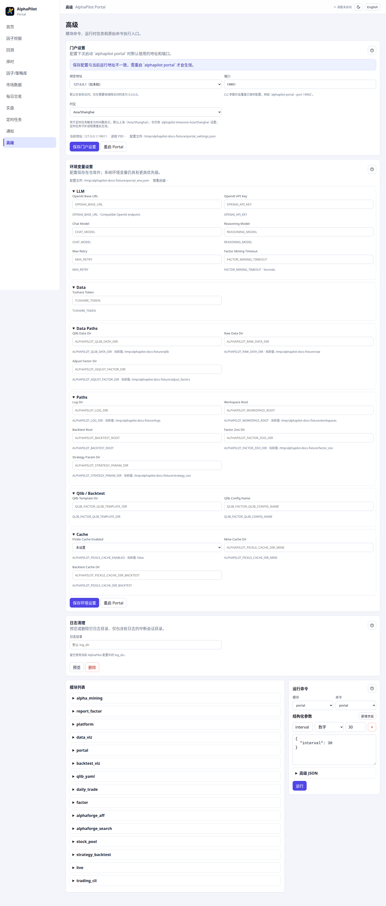

# 调度、通知与运维

## 适用场景与前置条件

用于重复执行数据/研究任务、发送运行结果以及维护本机 Portal。调度要求 Portal job 能正常执行；通知要求相应渠道凭据和收件方配置。远程命令接收器只应部署在受信任网络，并配置允许用户与配对。



## 调度

Portal 的“调度”页用于创建、启停、立即运行和删除计划任务：



```bash
alphapilot scheduler --interval=30
```

Portal 启动时如果存在启用的计划，会尽力启动 scheduler daemon。时区影响触发时间：

```bash
alphapilot timezone Asia/Shanghai
```

修改计划参数不会改变已在运行的 job；应等待、取消或完成旧 job 后再验证新配置。

## 通知和远程命令


在 Portal 配置 Telegram、飞书或邮件后先发送测试消息，再启动命令接收器：

```bash
alphapilot notify_commands --channel=telegram
```

凭据保存在权限受限的配置或环境变量中。远程命令必须配置允许用户和配对码；不要把 `/api/notify/feishu/events` 当作普通公开 API。

## Portal 和环境设置



“高级设置”可以修改监听地址、端口、时区和受支持的环境项。密钥只显示掩码；修改需要重启的配置后使用：

```bash
alphapilot portal_restart
```

## 日志和模块

```bash
alphapilot clean_logs --execute=False
alphapilot modules
```

先预览再执行日志清理。Portal 的“运行模块命令”直接调用已注册模块，属于本机高级入口；复杂 JSON、交易写操作和真实 UAT 更适合在 CLI 中执行并保留终端审计。

## 独立回退界面和弃用命令

- `data_viz`、`backtest_viz`：独立 Streamlit 回退工具。
- `ui`、`backtest_ui`：只输出迁移提示，分别由 Portal 挖掘和回测页面替代。
- 已删除的 `timing_*`、daemon strategy 和手工 stage evidence 命令不会重新注册。

## 输入、输出与安全

计划输入包括 job kind、cron/触发时间、时区和参数；输出是 schedule 状态、后台 job、日志及可选通知。通知凭据应来自权限受限文件或环境变量，文档、job 参数和日志只能记录脱敏字段。远程命令不得直接承载 Broker 密钥，也不应开放任意 shell 执行。

## Docker 与排错

Docker 部署见 [DOCKER.md](../DOCKER.md)。常见排查顺序：Portal `/api/status` → job 日志 → system/runtime state → ledger → Broker callback。涉及订单时先阻止新路由并撤销活动订单，再收集证据。

常见问题包括时区不一致导致错过触发、scheduler 进程未运行、通知 provider 鉴权失败以及长任务重叠。修复后先手工执行一次同参数 job，再重新启用计划；不要通过缩短轮询间隔反复触发失败任务。
