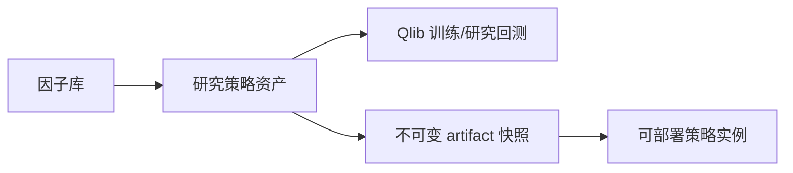
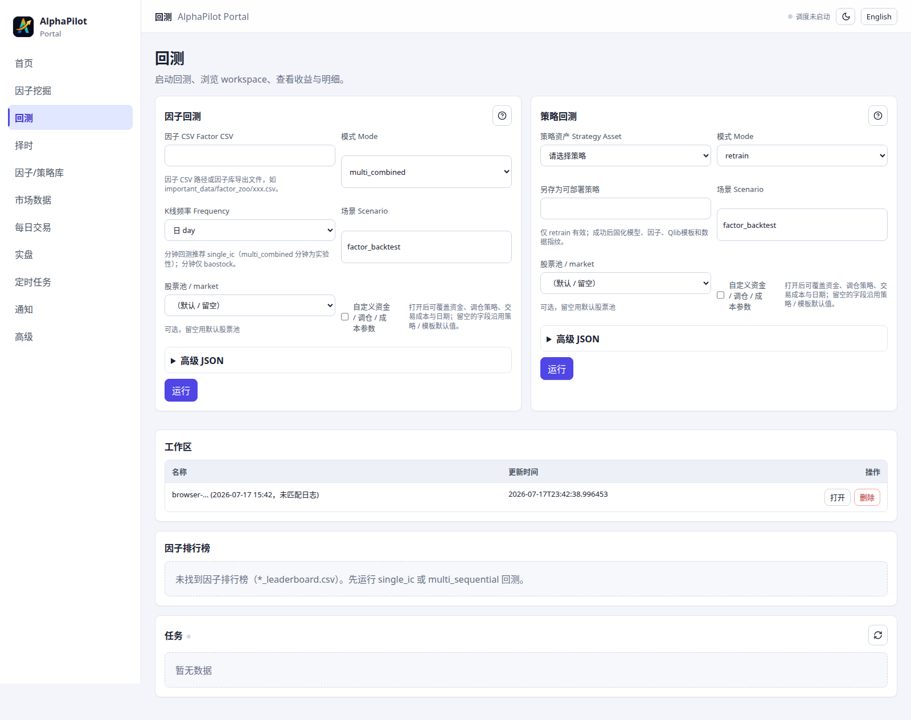

# 策略资产与研究回测

## 适用场景与前置条件

用于把因子组合、模型和 Qlib 配置保存为研究资产，并比较训练或回测结果。前置条件是因子已进入因子库、Qlib 数据可用，模型所需依赖已安装。研究回测不连接 Broker，也不赋予自动路由权限。

## 两类对象



“策略资产”保存因子、模型、Qlib 参数和研究结果；“策略实例”绑定稳定版本、参数、股票池、数据/组合政策和校验状态。已校验实例可执行 REPLAY 回放，或独立配置 PAPER、SIMULATION、SHADOW、LIVE 部署；部署模式和 runtime 状态不属于策略实例的校验生命周期。

## 从因子创建策略资产

```bash
alphapilot strategy_create \
  --strategy_name=demo_lgb \
  --factor_names=momentum_20,volatility_20 \
  --model_name=LightGBM --market=csi300
alphapilot strategy_backtest_list
```

Portal 入口是“因子与策略库”。因子或模型变化应创建新资产或新版本，避免覆盖已被实例快照引用的内容。

## 研究回测

```bash
# 因子 CSV 回测
alphapilot backtest --factor_path=/path/to/factors.csv --mode=multi_combined

# 已保存策略资产复测
alphapilot strategy_backtest --strategy_name=demo_lgb --mode=retrain
```



回测页展示收益、超额、账户构成、换手率、每日明细、因子排行榜和工作区。删除工作区会删除本地回测产物，操作前确认没有被报告或审计引用。

## Qlib YAML

```bash
alphapilot qlib_yaml_generate \
  --output=/tmp/qlib.yaml --template=baseline \
  --market=csi300 --topk=50
alphapilot qlib_yaml_validate --config=/tmp/qlib.yaml
```

验证包含 Schema 和可选 smoke；`--skip_smoke=True` 只适合不具备 Qlib 数据的静态检查环境。

## 研究回测与统一回放

| 项目 | 研究回测 | 策略实例统一回放 |
|---|---|---|
| 入口 | `backtest`、`strategy_backtest` | `trading_backtest` |
| 对象 | 因子文件或策略资产 | 不可变实例配置 |
| 目的 | 模型和组合研究 | 验证部署同一决策/执行语义 |
| 执行语义 | Qlib workflow | D 日决策、D+1 sizing、OMS/Risk/撮合 |
| 运行诊断 | 不产生 | 可形成 REPLAY 决策观察；只用于诊断和比较，不改变部署权限 |

`alphapilot backtest_viz` 是独立 Streamlit 回退工具，Portal 正常时无需使用。

## 输入、输出与安全

输入是因子文件或已保存策略资产、市场/日期、模型和 Qlib 参数；输出写入独立 workspace，包含配置、模型、预测、账户曲线、交易明细和摘要。不要覆盖已被策略实例 artifact 引用的模型文件；需要部署时应通过研究资产导入生成不可变快照。删除 workspace 只应在确认没有报告、实例或审计引用后执行。

## 常见问题

- 有策略资产但无法部署：先通过“研究资产导入”创建策略实例和 artifact 快照。
- 回测与实盘收益不同：真实账户、涨跌停、停牌、部分成交、费用和行情时间都会改变成交；应比较决策 provenance，而不是只比较收益。
