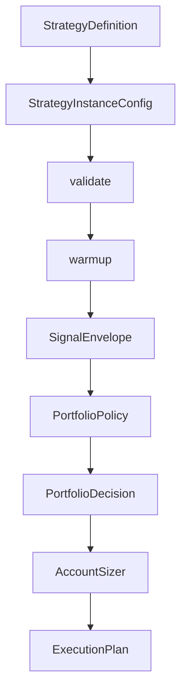
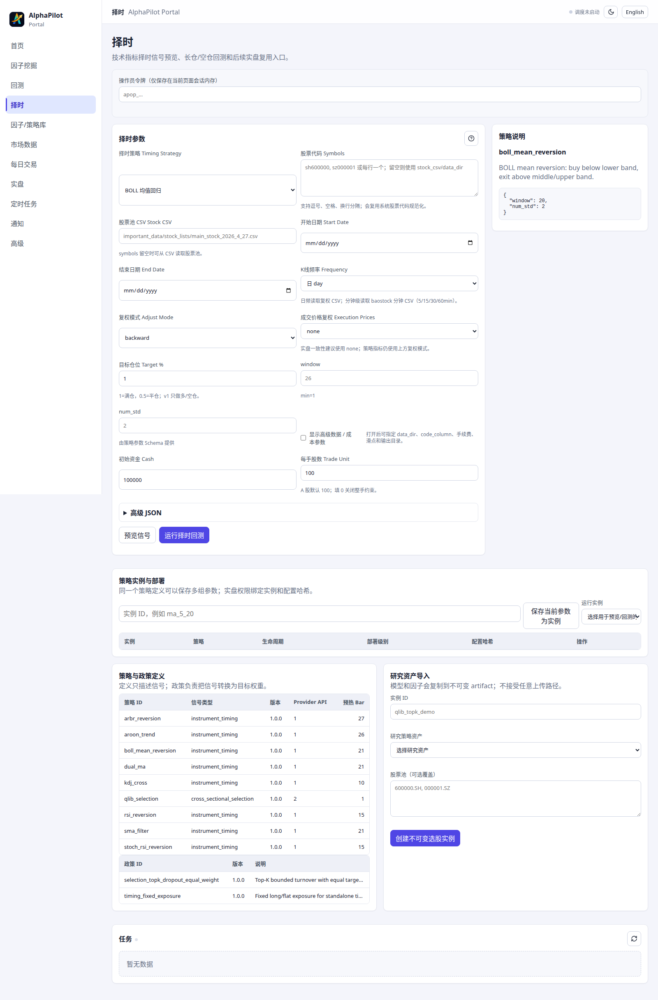
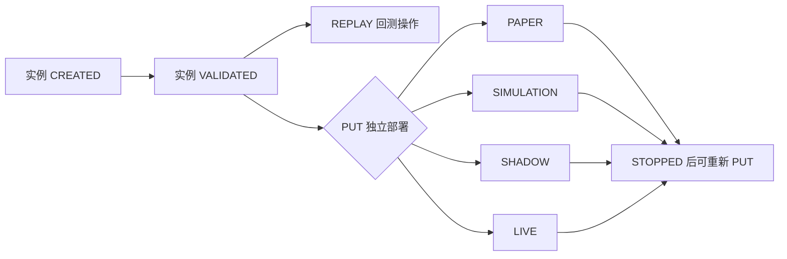

# 策略实例、预览和统一回测

## 适用场景与前置条件

用于把一个版本明确的规则策略或模型选股资产变成可验证、可回放和可部署的实例。创建前需要相应 `StrategyDefinition`、股票池/数据、组合政策以及可信 artifact；任何正式运行模式都先通过实例校验。

## 核心流程



同一个策略定义可以创建多组参数实例。例如 `dual_ma` 可以分别创建 `ma_5_20` 和 `ma_20_60`；这与是否使用机器学习模型无关。



## 查看定义和政策

```bash
alphapilot trading_definitions
alphapilot trading_policies
```

内置择时包括均线、布林线、KDJ、RSI、ARBR、Aroon 等；`qlib_selection` 输出横截面选股分数。`timing_fixed_exposure` 和 `selection_topk_dropout_equal_weight` 负责把不同信号转换为目标权重。选股与择时独立运行，当前不自动组合。

## 创建规则择时实例

```bash
alphapilot trading_instance_create \
  --instance_id=ma_5_20 \
  --strategy_id=dual_ma \
  --universe=600000.SSE,510300.SSE \
  --params='{"short_window":5,"long_window":20}' \
  --frequency=day \
  --data_policy='{"feature_adjustment":"backward","history_window":21,"data_version":"daily-bars-2026-07"}' \
  --portfolio_policy='{"policy_id":"timing_fixed_exposure","version":"1.0.0","params":{"target_percent":0.2}}'

alphapilot trading_instance_validate --instance_id=ma_5_20
```

## 从研究资产创建选股实例

```bash
alphapilot trading_instance_from_research \
  --instance_id=selection_demo \
  --strategy_name=demo_lgb \
  --universe=600000.SSE,000001.SZ,510300.SSE \
  --portfolio_policy='{"policy_id":"selection_topk_dropout_equal_weight","version":"1.0.0","params":{"topk":2,"n_drop":1}}'
```

系统会复制模型、因子和必要模板到不可变 artifact，自动实例不能引用任意 pickle 路径。不同模型或因子集合建议创建不同实例 ID；替换绑定后实例会回到待验证状态，并使已有部署变为 `stale`。

## Preview 与异步回放

```bash
alphapilot trading_preview \
  --instance_id=ma_5_20 --output_path=/tmp/preview.json

alphapilot trading_backtest \
  --instance_id=ma_5_20 --wait=True \
  --output_dir=/tmp/ma_5_20-replay
```

回放产物绑定 `instance_id`、`config_hash`、代码/模型/数据/政策版本，包含 signals、weights、targets、plans、orders、fills、positions、equity 和 summary。

## 实例验证与独立部署



- REPLAY：历史时钟和模拟 Broker，只由 `trading_backtest` 创建，不是部署模式。
- PAPER：本地账户与撮合，不连接真实账户。
- SIMULATION：券商仿真账户，要求仿真交易 Provider 和 `account_profile`。
- SHADOW：真实行情和账户只读，强制不能路由。
- LIVE：真实交易，可从已验证实例直接配置，不依赖 PAPER/SHADOW/UAT/一致性记录。

```bash
alphapilot trading_deploy --instance_id=ma_5_20 --run_mode=paper
alphapilot trading_start --instance_id=ma_5_20
alphapilot trading_deployments
alphapilot trading_diagnostics --instance_id=ma_5_20
```

切换模式或 Provider 前必须停止 daemon，再重新调用 `trading_deploy`。参数、代码、模型、因子、政策或股票池变化会改变 `config_hash`；原部署保留但标记 `stale`，重新验证并再次部署后才能启动。LIVE 仍要求环境开关、真实账户和实时行情 Provider；启动后先对账，再显式 `trading_resume`。SHADOW 永久禁止路由。

运行会话、异常计数和决策比较只是中性诊断。研究 campaign 可以自行要求 20 个 PAPER 日、5 个 SHADOW 日、比较结果或 Broker UAT，但这些条件不会改变部署权限。

## 自定义策略

- v1：实现 `generate_signals(DataFrame)`，系统包装为个股择时 provider。
- v2：实现完整生命周期并返回类型化 `SignalEnvelope`。
- 本地策略必须放在显式 `strategy.toml` 清单下；pip 包使用 `alphapilot.strategies` entry point。

详细开发接口见[自定义策略与组合政策](../developer/strategy-extension.md)。

## 输入、输出与安全

实例输入包括定义版本、参数、universe、频率、数据政策、组合政策和 artifact binding。preview 产出类型化信号与权重；backtest 进一步产出决策、目标、执行计划、订单、成交、持仓和权益。正式策略代码不能访问 Broker 或直接创建 Broker 订单，任何配置变化都必须形成新 `config_hash` 并重新验证。

## 常见错误

- `WARMING_UP` 不结束：历史窗口不足、最后时间或数据版本未对齐。
- preview 被拒绝：检查已完成 Bar、artifact/code hash 和策略参数 Schema。
- 回放无法成交：检查 D+1 原始报价、合约单位、停牌/涨跌停和现金。
- 无法部署：确认实例为 `validated`、daemon 已停止、`data_version` 存在，并检查运行模式与 Provider 元数据是否匹配。
- LIVE 无法路由：检查环境开关、账户/Provider/binding hash、单账户 writer lock、对账、心跳、Kill Switch 和逐单 RiskGate；诊断会话不会解除这些阻断。
